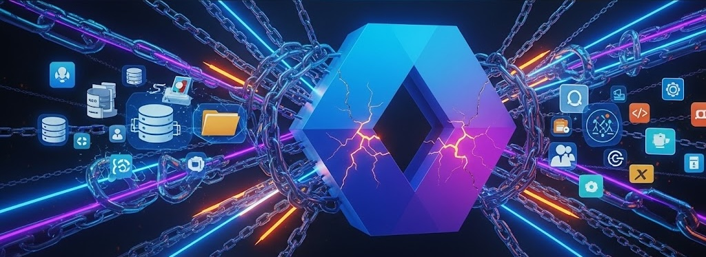

## Qui surveille les surveillants à l’ère de l’identité numérique ?

> « Ferme la porte, bloque-la, mais qui surveillera les surveillants eux-mêmes ? La femme est maligne et commencera par eux. »  
> — Juvénal, Satires, VI, vers 31–32

Cette citation sur la fidélité est devenue un symbole de réflexion sur le pouvoir, la confiance et la surveillance. La question "_Quis custodiet ipsos custodes ?_" — _Qui surveille les surveillants ?_ — résonne fortement aujourd’hui dans le domaine de la **cybersécurité**.

Quand l’identité numérique est devenue le nouveau périmètre, peut-on vraiment confier sa gestion au même fournisseur que notre infrastructure ?

Un client m’a récemment demandé : _“Pourquoi payer pour Okta ? Mon fournisseur actuel me donne déjà tout : cloud, e-mail, stockage, BI, sécurité… et aussi la gestion des identités. Pourquoi payer deux fois ?”_

Cela montre une idée fausse : que l’**IAM** est juste une fonctionnalité, pas un choix stratégique. Il ne s’agit pas de comparer deux produits, mais deux approches : centralisée ou indépendante.

## Zero Trust : L’identité comme fondement de la sécurité

Le modèle classique de sécurité périmétrique ne fonctionne plus. Avec le travail à distance, les SaaS et les API, la confiance implicite est un risque. Le modèle **Zero Trust**, basé sur « ne jamais faire confiance, toujours vérifier », place **l’identité** au centre.

Le [modèle de maturité Zero Trust de la CISA](https://www.cisa.gov/zero-trust-maturity-model) place l’identité en premier pilier. Un bon IAM doit :

- **Appliquer des politiques adaptatives**, selon l’utilisateur, le lieu, l’heure, etc.
- **Utiliser une authentification forte**, comme la MFA adaptative, résistante au phishing.

Des outils comme **FastPass**, **MFA adaptative** et **ITP** assurent que seuls les bons utilisateurs et appareils accèdent aux ressources.

Les fondations sont :

- **Gouvernance** : Qui peut accéder à quoi, quand et comment ? Des outils comme **Okta Identity Governance** garantissent conformité et retrait rapide des droits.
- **Automatisation & Orchestration** : Avec **Okta Workflows**, on peut automatiser la gestion des identités, réduire les erreurs et réagir rapidement.
- **Visibilité & Analyse** : Avec **Okta ISPM**, on surveille la posture de sécurité des identités et on détecte les risques tôt.

Autres piliers :

- **Appareil** : L’intégration IAM + gestion des appareils garantit l’accès uniquement depuis des terminaux sûrs. **Okta Desktop Access** lie identité et appareil. Les outils **EDR** (comme **CrowdStrike**) bloquent l’accès en cas de menace.
- **Réseau** : Les anciens périmètres réseau n’existent plus. L’authentification basée sur l’identité (via **VPN**, **Zscaler**...) est essentielle.
- **Applications & Charges de travail** : L’IAM protège les apps avec **SSO**, **MFA** et standards ouverts (**OIDC**, **SAML**). Cela centralise l’accès et les autorisations.
- **Données** : L’IAM permet de limiter l’accès aux données sensibles, en fonction du rôle et du contexte, et d’éviter les fuites (via **DLP**).

## Identity Fabric : Une architecture d’identité unifiée

L’**Identity Fabric** est un cadre qui relie tous les systèmes IAM pour créer une vue unifiée.

**Okta agit comme orchestrateur central**, en connectant les identités, les applications et les infrastructures (cloud, on-prem, multi-cloud). Cette approche agnostique garantit une politique cohérente et un contrôle sur toutes les identités — humaines ou non.

## Les risques cachés des solutions intégrées

Choisir un IAM intégré au fournisseur cloud peut sembler simple et économique, mais c’est risqué :

1. **Point unique de défaillance** : Une faille chez le fournisseur peut compromettre toute l’entreprise.
2. **Verrouillage propriétaire** : La migration devient coûteuse et difficile.
3. **Conflit d’intérêt** : Le fournisseur peut privilégier son écosystème au lieu de la sécurité ouverte et transparente.

## Pourquoi choisir un IAM agnostique ?

Un IAM **agnostique** comme **Okta** est ouvert, modulaire et neutre.

- **Souplesse** : Utilisez les meilleurs outils pour chaque besoin tout en centralisant l’identité.
- **Standards ouverts** : Protocoles comme OAuth2, OIDC, SAML, SCIM.
- **Aucune dépendance propriétaire** : Liberté de changer et d’évoluer.
- **Gouvernance renforcée** : Avec IGA, PAM et ISPM pour gérer le cycle de vie des identités, les comptes sensibles et la posture sécurité.

Okta investit en continu dans l’innovation, la transparence et la sécurité.

## Conclusion : L’identité comme arbitre neutre

L’identité est aujourd’hui le cœur de la sécurité. Choisir un IAM est une décision stratégique.

Confier l’infrastructure, les données et l’IAM à un seul acteur peut sembler pratique, mais **la vraie sécurité repose sur la séparation des pouvoirs, la transparence et le choix libre**.

Comme le disait Juvénal : **« Qui surveille les surveillants ? »**  
L’IAM doit être un arbitre, pas un joueur.

Adopter un **IAM agnostique**, comme un **Identity Fabric**, permet une gestion sécurisée, unifiée et évolutive. Cela réduit les risques, augmente l’agilité et soutient le modèle Zero Trust.

La vraie sécurité vient de la liberté. Une architecture IAM indépendante est **plus sûre, plus résiliente et plus libre**.

## ✋ Et vous ?

📣 Quelle est votre expérience avec les solutions IAM ? Avez-vous déjà dû choisir entre une solution intégrée ou indépendante ?

💬 Partagez votre avis en commentaire, ou contactez-moi pour échanger sur le rôle d’un Identity Fabric dans votre entreprise.
