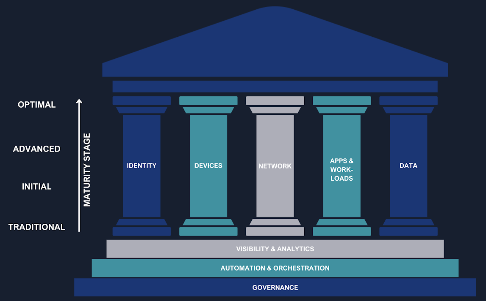

## Chi sorveglia i sorveglianti nell'era dell'identità digitale?

> «Pone seram, cohibe, sed quis custodiet ipsos custodes? Cauta est et ab illis incipit uxor.»
>
> *Decimo Giunio Giovenale, Satire, VI, O31-O32*

*«Spranga la porta, impedisci di uscire, ma **chi sorveglierà i sorveglianti?** La moglie è astuta e comincerà da quelli.»*

Originariamente riferita alla difficoltà di controllare l’infedeltà coniugale, questa riflessione del poeta romano Giovenale è diventata una massima senza tempo sulla natura del potere, della fiducia e della vigilanza. La domanda “_Quis custodiet ipsos custodes?_” — _Chi sorveglia i sorveglianti?_ — risuona oggi con forza nel mondo della **cybersecurity**, spingendoci a interrogarci su chi protegge i sistemi che, a loro volta, proteggono noi.

In un'era in cui il perimetro di sicurezza non è più fisico, ma virtuale, l'identità digitale è diventata il nuovo baluardo da proteggere. Questo ci porta a un paradosso cruciale: possiamo davvero affidare la gestione delle identità allo stesso fornitore che ospita la nostra infrastruttura e i nostri servizi?

Di recente, un cliente mi ha posto una domanda volutamente provocatoria: *"A cosa serve Okta? Il mio fornitore attuale mi può dare già tutto: infrastruttura, posta elettronica, storage, Business Intelligence, protezione dei dispositivi... e anche la gestione delle identità. Perché dovrei spendere altri soldi per Okta quando posso avere tutto praticamente gratis e integrato in quello che già ho?".* Questa affermazione, apparentemente logica e innocua, rivela una percezione diffusa: che l'**IAM (Identity and Access Management)** sia una semplice funzionalità integrata, non una scelta strategica. Il dibattito non è tra due prodotti, ma tra un modello centralizzato e un'architettura indipendente e agnostica.

## Zero Trust: L'Identità come Pilastro della Sicurezza

Il modello di sicurezza tradizionale, basato sul concetto di "trusted perimeter", è ormai superato. In un mondo dove si lavora da remoto, si accede a risorse SaaS e si interagisce con API, la fiducia implicita è una vulnerabilità. La risposta a questa sfida è il modello Zero Trust, la cui filosofia cardine è "non fidarsi mai, verificare sempre".s

Il [CISA's Zero Trust Maturity Model (ZTMM)](https://www.cisa.gov/zero-trust-maturity-model), un framework riconosciuto a livello globale, identifica l'**identità come il primo dei pilastri fondamentali** di questa architettura. L'identità non è solo un componente, ma il punto di controllo primario su cui si fonda l'intera strategia di sicurezza. Per implementare con successo questo modello, un'organizzazione ha bisogno di un sistema IAM robusto in grado di:

- **Applicare politiche adattive:** Adattare dinamicamente le politiche di accesso in base al contesto (utente, dispositivo, posizione, ora).
- **Utilizzare un'autenticazione forte:** Implementare un'autenticazione a più fattori (MFA) intelligente e adattiva.

Strumenti come l'**Adaptive MFA e l'Identity Threat Protection (ITP)** diventano essenziali per realizzare questi obiettivi, garantendo che solo gli utenti e i dispositivi legittimi possano interagire con le risorse aziendali.

Governance, Automation and Orchestration, Visibility and Analytics, sono poste come le fondamenta. Anche qui piattaforme come **Okta** aiutano i clienti con strumenti come:

* Okta Identity Governance: Per assicurare che gli accessi siano conformi alle politiche aziendali e che vengano revocati tempestivamente quando non sono più necessari.
* Okta Workflows: Per automatizzare i processi di gestione delle identità e degli accessi, riducendo gli errori manuali e migliorando l'efficienza.
* Okta ISPM (Identity Security Posture Management): Per analizzare costantemente la salute della sicurezza delle identità e rilevare anomalie.

Quanto agli altri "pillars":

- Device:
  - Okta Desktop Access (ODA)
  - Integrazioni con strumenti di terze parti come EDR (es. Crowdstrike) completano la protezione di questo aspetto
- Networks
  - L'integrazione dell'IAM con VPN e strumenti ZLA (es. Zscaler)
- Application & Workloads
  - completare
- Data
  - completare2

## Identity Fabric: L'architettura che unisce le identità

L'evoluzione del panorama digitale ha portato a un'esplosione di identità. Non si tratta più solo di dipendenti e collaboratori, ma anche di entità non umane: bot, API, workload e microservizi. La gestione di queste identità, spesso effimere e dinamiche, in un'architettura frammentata crea una superficie di attacco significativa e spesso trascurata.

Per superare la complessità e la frammentazione di questi ecosistemi, il concetto di **Identity Fabric** emerge come l'approccio architetturale più efficace. L'**Identity Fabric** non è un singolo prodotto, ma un framework completo che integra e orchestra tutti i sistemi IAM disparati per funzionare come un unico sistema unificato. Questo approccio crea un "tessuto" di sicurezza coerente che si estende su tutta l'infrastruttura IT aziendale, eliminando i silos e i punti ciechi di sicurezza. In pratica, consente di orchestrare identità e accessi in modo agile, scalabile e sicuro, adattandosi a una realtà cloud-first e API-driven.

--
Mentre il modello Zero Trust fornisce i principi fondamentali per una sicurezza moderna, l'evoluzione del panorama digitale richiede un passo ulteriore. L'esplosione di identità digitali, che non si limitano più solo a dipendenti e collaboratori, ma includono anche una miriade di entità non umane (bot, API, workload, microservizi), ha creato un ecosistema estremamente complesso e frammentato. La gestione di queste identità, spesso effimere e dinamiche, in un'architettura disconnessa crea una superficie di attacco significativa e spesso trascurata.

Per superare la complessità e la frammentazione di questi ecosistemi, il concetto di **Identity Fabric** emerge come l'approccio architetturale più efficace. L'Identity Fabric non è un singolo prodotto, ma un framework completo che integra e orchestra tutti i sistemi IAM disparati per funzionare come un unico sistema unificato. Questo approccio crea un "tessuto" di sicurezza coerente che si estende su tutta l'infrastruttura IT aziendale, eliminando i silos e i punti ciechi di sicurezza.

**Okta è progettata per fungere da orchestratore centrale in questo Identity Fabric.** Grazie alle sue ampie capacità di integrazione, Okta connette e gestisce tutte le identità, applicazioni e infrastrutture (IaaS, on-prem, multi-cloud), indipendentemente dal fornitore. Questo approccio agnostico non solo garantisce una visibilità completa e un controllo centralizzato, ma permette anche di applicare politiche di sicurezza coerenti a tutte le entità digitali, umane e non umane. In pratica, consente di orchestrare identità e accessi in modo agile, scalabile e sicuro, adattandosi a una realtà cloud-first e API-driven, portando i principi Zero Trust a un livello di implementazione più ampio e coeso.

## Il Rischio Nascosto del Fornitore Integrato

Scegliere una soluzione IAM fornita dallo stesso vendor che gestisce la tua infrastruttura e i tuoi dati nel cloud può sembrare comodo ed economicamente conveniente, ma presenta rischi significativi. Vediamoli nel dettaglio.

1. **Single Point of Failure (SPoF)**: Affidarsi a un unico fornitore per l'infrastruttura IT e per la gestione dell'identità espone a una pericolosa concentrazione di rischio di sicurezza. Se un attaccante riesce a compromettere il provider, l'intero stack aziendale è a rischio: le identità degli utenti e degli asset, i relativi accessi, le applicazioni e i dati sensibili. La violazione del sistema IAM (Identity and Access Management) integrato, in particolare, concede all'attaccante le "chiavi del regno", permettendogli di muoversi lateralmente e di accedere a tutte le risorse e informazioni critiche all'interno dell'ecosistema aziendale, con conseguenze potenzialmente devastanti in termini di furto di dati, interruzione delle operazioni e compromissione della reputazione.
2. **Vendor Lock-in**: La profonda integrazione con l'ecosistema proprietario di un singolo fornitore può intrappolare le aziende in un lock-in quasi irreversibile. La migrazione diventa un processo proibitivamente costoso e dispendioso, limitando drasticamente la flessibilità di adottare nuove tecnologie o di negoziare condizioni economiche più vantaggiose.
3. **Conflitto di interessi e mancanza di imparzialità**: Quando un fornitore controlla sia i servizi che il meccanismo di sicurezza, emerge un conflitto di interessi intrinseco. Le sue priorità potrebbero non essere la sicurezza o l'interoperabilità universale, ma l'integrazione profonda con il proprio ecosistema. Questo può portare a compromessi sulla sicurezza, a scorciatoie nella protezione e, in ultima analisi, a una mancanza di trasparenza.

## I Vantaggi dell'Agnosticismo IAM

Una soluzione **IAM agnostica**, come **Okta**, è progettata per essere neutrale, interoperabile e modulare. Scegliere una piattaforma indipendente offre i seguenti vantaggi:

- **Flessibilità e Agilità**: Con un ampio catalogo di integrazioni, una soluzione agnostica permette alle aziende di adottare una strategia "best-of-breed", scegliendo i migliori strumenti per ogni funzione aziendale e unificando la gestione delle identità in un'unica piattaforma sicura.
  Ad esempio è possibile scegliere soluzioni di fornitori diversi per: Infrastruttura (IaaS), Collaboration (e-mail, file, instant messaging), EDR, Antispam, ecc.
- **Neutralità e Standard Aperti**: Soluzioni agnostiche si basano su standard aperti (OAuth 2.0, OIDC, SAML, SCIM), evitando logiche proprietarie. Questa neutralità favorisce la portabilità, la compliance e l’interoperabilità tra ecosistemi diversi.
  Questo impegno si manifesta nell'iniziativa IPSIE (Identity Provider Security and Integration Ecosystem) promossa in collaborazione con la OpenID Foundation. L'obiettivo è creare il primo standard di sicurezza unificato per le identità aziendali, un'iniziativa che mira a democratizzare la sicurezza e a garantire l'interoperabilità a beneficio dell'intero settore.
- **Nessuna dipendenza da logiche proprietarie**: Questo approccio elimina completamente qualsiasi dipendenza da logiche proprietarie, garantendo che il sistema sia flessibile, interoperabile e a prova di futuro. L'indipendenza da soluzioni vincolanti permette alle organizzazioni di scegliere le tecnologie più adatte alle proprie esigenze senza essere limitate dalle decisioni di un singolo fornitore. Ciò favorisce l'innovazione e la capacità di adattamento in un panorama tecnologico in continua evoluzione.
- **Resilienza e Governance Rafforzata**: Un IAM agnostico non si limita al login. Offre strumenti di Identity Governance (IGA) per gestire il ciclo di vita delle identità, il Privileged Access Management (PAM) per proteggere gli account sensibili e l'Identity Security Posture Management (ISPM) per un monitoraggio continuo.

Okta si impegna in un processo continuo di miglioramento della sicurezza attraverso investimenti in innovazione, controlli e trasparenza.

## Conclusioni: L'identità come arbitro imparziale

Nel panorama digitale odierno, l'identità è il nuovo perimetro di sicurezza. La scelta di una piattaforma IAM non è meramente una decisione tecnica, ma una scelta strategica fondamentale. Affidarsi a un unico fornitore per infrastruttura, dati e identità può apparire apparentemente vantaggioso, ma la vera sicurezza si fonda sulla separazione dei poteri, sulla trasparenza e sulla libertà di scelta.

Come abbiamo citato all’inizio: *"Chi sorveglia i sorveglianti?"*. **L'IAM deve operare come un arbitro imparziale, non come un giocatore in campo.**

Adottare una soluzione **IAM agnostica**, che si configuri come un vero e proprio Identity Fabric, significa implementare un'architettura che assicura una gestione delle identità unificata e sicura. Questo approccio riduce i rischi, incrementa la flessibilità e supporta pienamente una strategia Zero Trust.

La sicurezza autentica deriva dalla separazione dei poteri: **chi è preposto alla protezione non può essere colui che controlla ogni aspetto.** Un'**architettura IAM indipendente** non solo è più sicura, ma è anche intrinsecamente più **resiliente, scalabile e libera**.

## ✋ E tu?

📣 Qual è la tua esperienza con le soluzioni IAM? Hai mai affrontato il dilemma tra una soluzione integrata e una indipendente?

💬 Condividi la tua opinione nei commenti e, se sei interessato a capire come un Identity Fabric può proteggere la tua azienda, non esitare a contattarmi in privato per saperne di più.
