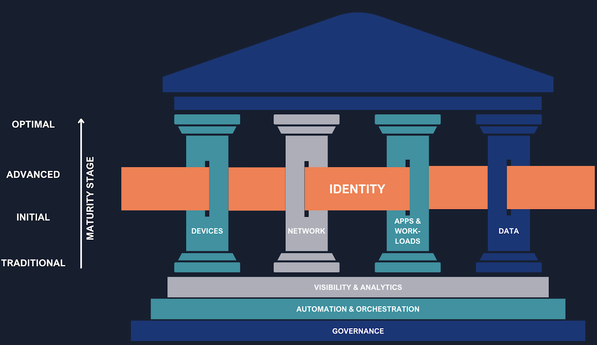
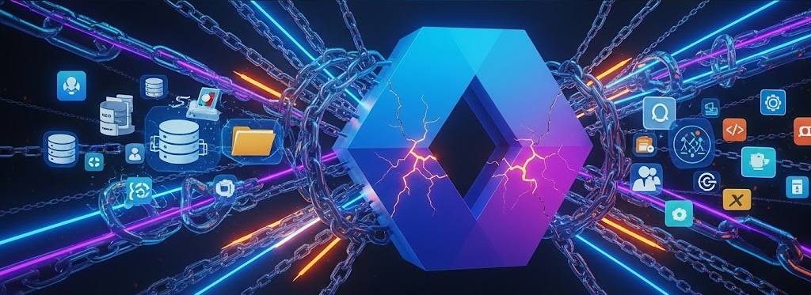

## Who Watches the Watchmen in the Age of Digital Identity?

> «Pone seram, cohibe, sed quis custodiet ipsos custodes? Cauta est et ab illis incipit uxor.»
>
> *Decimus Junius Juvenal, Satires, VI, O31-O32*

*"Lock the door, keep her in, but **who will watch the watchmen?** The wife is clever and will start with them."*

Originally referring to the difficulty of controlling marital infidelity, this reflection by the Roman poet Juvenal has become a timeless maxim on the nature of power, trust, and vigilance. The question "_Quis custodiet ipsos custodes?_" — _Who watches the watchmen?_ — resonates strongly today in the world of **cybersecurity**, pushing us to question who protects the systems that, in turn, protect us.

In an era where the security perimeter is no longer physical but virtual, digital identity has become the new fortress to protect. This leads us to a crucial paradox: can we truly entrust identity management to the same provider that hosts our infrastructure and services?

Recently, a client asked me a deliberately provocative question: *"What's the point of Okta? My current provider can already give me everything: infrastructure, email, storage, Business Intelligence, device protection... and also identity management. Why should I spend more money on Okta when I can have everything practically for free and integrated with what I already have?"* This statement, seemingly logical and harmless, reveals a widespread perception: that **IAM (Identity and Access Management)** is a simple integrated feature, not a strategic choice. The debate is not between two products, but between a centralized model and an independent, agnostic architecture.

## Zero Trust: Identity as the Pillar of Security

The traditional security model, based on the concept of a "trusted perimeter," is now obsolete. In a world where people work remotely, access SaaS resources, and interact with APIs, implicit trust is a vulnerability. The answer to this challenge is the Zero Trust model, whose core philosophy is "never trust, always verify."

The [CISA's Zero Trust Maturity Model (ZTMM)](https://www.cisa.gov/zero-trust-maturity-model), a globally recognized framework, identifies **identity as the first of the fundamental pillars** of this architecture. Identity is not just a component, but the primary control point on which the entire security strategy is based. To successfully implement this model, an organization needs a robust IAM system capable of:

- **Applying adaptive policies:** Dynamically adjusting access policies based on context (user, device, location, time).
- **Using strong authentication:** Implementing smart, adaptive, and phishing-resistant multi-factor authentication (MFA).

Tools like **FastPass**, **Adaptive MFA, and Identity Threat Protection (ITP)** become essential to achieve these goals, ensuring that only legitimate users and devices can interact with company resources.

If we then analyze the **foundations**, we find:

- **Governance**: It defines the rules and policies that guide the entire security strategy. It's not enough to implement the right tools; it's crucial to establish who can access what, under which conditions, and for how long.
  Solutions like **Okta Identity Governance** become vital in this context, as they ensure that access is always compliant with company policies and is promptly revoked when no longer needed. This approach not only strengthens security but also ensures regulatory compliance.
- **Automation and Orchestration**: The effectiveness of a Zero Trust model depends on its ability to react quickly to changes in context. Manually managing every single access request or device status change would be impossible. Tools like **Okta Workflows** allow for the automation of identity and access management processes, eliminating the need for manual intervention, reducing human error, and significantly improving operational efficiency. Automation allows the system to adapt in real-time, applying the "never trust, always verify" philosophy in a scalable way.
- **Visibility and Analytics**: To make informed decisions and respond to threats, an organization must have a clear and constant view of what is happening in its ecosystem. Platforms like **Okta ISPM (Identity Security Posture Management)** are designed to continuously analyze the health of identity security, providing valuable data and insights that help identify and mitigate risks before they can become serious problems. The ability to analyze data and visualize access patterns is the cornerstone of the Zero Trust model's proactive response capability.

As for the other "pillars":

- **Device**: The device from which a user attempts to access company resources represents the first point of contact and a potential vulnerability. Integrating IAM with Device Management ensures that only trusted, security-compliant devices can access applications and data. Additionally, **Okta Desktop Access (ODA)** allows for the implementation of multi-factor authentication directly from the desktop, linking the user's identity to the device. This protection is further strengthened by integrations with third-party tools like **EDR** (**Endpoint Detection and Response**), such as **CrowdStrike**, which constantly monitor the device's security status and report anomalies, blocking access in case of detected threats.
- **Networks**: The traditional network perimeter no longer exists. With the adoption of the cloud and hybrid work, access to resources occurs from uncontrolled networks. The integration of IAM with network security systems is therefore crucial. Identity-based authentication and authorization extend to tools like VPNs and, more advanced, to **ZTA (Zero Trust Architecture)** systems, such as **Zscaler**. This approach ensures that access to specific network resources is not based on geographical location or the source network, but on the validity of the user's identity, their device, and the context of the request.
- **Application & Workloads**: Applications and workloads are the heart of business activity and represent a primary target for attackers. Protecting this pillar is based on extending IAM to the applications themselves, ensuring that every access and operation is traceable, verified, and compliant with policies. **Single Sign-On (SSO)** and **Multi-Factor Authentication (MFA)** mechanisms for applications are fundamental to reducing the attack surface. Integration with third-party tools and standardization through protocols like **SAML** and **OIDC (OpenID Connect)** allow for centralized identity management across all applications, both internal and external, and for controlling authorizations at a granular level.
- **Data**: Ultimately, the purpose of all security pillars is to protect data. Integrating IAM with Data Protection Policies and with data security tools, such as **DLP (Data Loss Prevention)** systems, allows for applying identity-based access policies directly to the data, regardless of where it is located (at-rest or in-transit). This ensures that only authorized users can access sensitive data, with specific permissions based on their role and context. Furthermore, it prevents data leakage, even unintentional, by blocking non-compliant operations.

## Identity Fabric: The Architecture that Unites Identities

To overcome the complexity and fragmentation of these ecosystems, the concept of the **Identity Fabric** emerges as the most effective architectural approach. The Identity Fabric is not a single product, but a complete framework that integrates and orchestrates all disparate IAM systems to function as a single, unified system. This approach creates a coherent security "fabric" that extends across the entire corporate IT infrastructure, eliminating silos and security blind spots.

**Okta is designed to act as the central orchestrator in this Identity Fabric.** Thanks to its extensive integration capabilities, Okta connects and manages all identities, applications, and infrastructures (IaaS, on-prem, multi-cloud), regardless of the provider. This agnostic approach not only ensures complete visibility and centralized control but also allows for the application of consistent security policies to all digital entities, human and non-human. In practice, it enables agile, scalable, and secure orchestration of identities and access, adapting to a cloud-first and API-driven reality, and taking Zero Trust principles to a broader and more cohesive level of implementation.

## The Hidden Risk of the Integrated Provider

Choosing an IAM solution provided by the same vendor that manages your infrastructure and data in the cloud may seem convenient and cost-effective, but it presents significant risks. Let's look at them in detail.

1.  **Single Point of Failure (SPoF)**: Relying on a single provider for both IT infrastructure and identity management exposes you to a dangerous concentration of security risk. If an attacker manages to compromise the provider, the entire corporate stack is at risk: user and asset identities, their access, applications, and sensitive data. A breach of the integrated IAM (Identity and Access Management) system, in particular, gives the attacker the "*keys to the kingdom*", allowing them to move laterally and access all critical resources and information within the corporate ecosystem, with potentially devastating consequences in terms of data theft, operational disruption, and reputational damage.
2.  **Vendor Lock-in**: Deep integration with a single provider's proprietary ecosystem can trap companies in an almost irreversible lock-in. Migration becomes a prohibitively expensive and time-consuming process, drastically limiting the flexibility to adopt new technologies or negotiate more favorable economic terms.
3.  **Conflict of Interest and Lack of Impartiality**: When a provider controls both the services and the security mechanism, an inherent conflict of interest arises. Its priorities may not be security or universal interoperability, but deep integration with its own ecosystem. This can lead to security compromises, protection shortcuts, and ultimately, a lack of transparency.

## The Advantages of IAM Agnosticism

An **agnostic IAM** solution, like **Okta**, is designed to be neutral, interoperable, and modular. Choosing an independent platform offers the following advantages:

- **Flexibility and Agility**: With a large catalog of integrations, an agnostic solution allows companies to adopt a "best-of-breed" strategy, choosing the best tools for each business function and unifying identity management on a single, secure platform.
  For example, it is possible to choose solutions from different providers for: Infrastructure (IaaS), Collaboration (email, files, instant messaging), EDR, Antispam, etc.
- **Neutrality and Open Standards**: Agnostic solutions are based on open standards (OAuth 2.0, OIDC, SAML, SCIM), avoiding proprietary logic. This neutrality promotes portability, compliance, and interoperability between different ecosystems.
  This commitment is manifested in the IPSIE (Identity Provider Security and Integration Ecosystem) initiative promoted in collaboration with the OpenID Foundation. The goal is to create the first unified security standard for corporate identities, an initiative that aims to democratize security and ensure interoperability for the benefit of the entire industry.
- **No Dependence on Proprietary Logic**: This approach completely eliminates any dependence on proprietary logic, ensuring that the system is flexible, interoperable, and future-proof. Independence from binding solutions allows organizations to choose the technologies best suited to their needs without being limited by the decisions of a single provider. This fosters innovation and adaptability in a constantly evolving technological landscape.
- **Resilience and Strengthened Governance**: An agnostic IAM goes beyond just login. It offers Identity Governance (IGA) tools to manage the identity lifecycle, Privileged Access Management (PAM) to protect sensitive accounts, and Identity Security Posture Management (ISPM) for continuous monitoring.

Okta is committed to a continuous process of security improvement through investments in innovation, controls, and transparency.

## Conclusion: Identity as an Impartial Referee

In today's digital landscape, identity is the new security perimeter. The choice of an IAM platform is not merely a technical decision but a fundamental strategic choice. Relying on a single provider for infrastructure, data, and identity may seem advantageous, but true security is based on the separation of powers, transparency, and freedom of choice.

As we quoted at the beginning: *"Who watches the watchmen?"*. **IAM must operate as an impartial referee, not as a player on the field.**

Adopting an **agnostic IAM** solution, which acts as a true Identity Fabric, means implementing an architecture that ensures unified and secure identity management. This approach reduces risks, increases flexibility, and fully supports a Zero Trust strategy.

Authentic security comes from the separation of powers: **the one responsible for protection cannot be the one who controls every aspect.** An **independent IAM architecture** is not only more secure but is also inherently more **resilient, scalable, and free**.

## ✋ And you?

📣 What is your experience with IAM solutions? Have you ever faced the dilemma between an integrated solution and an independent one?

💬 Share your opinion in the comments and, if you are interested in understanding how an Identity Fabric can protect your company, do not hesitate to contact me privately to learn more.