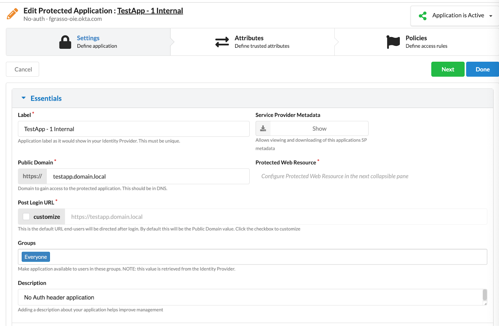
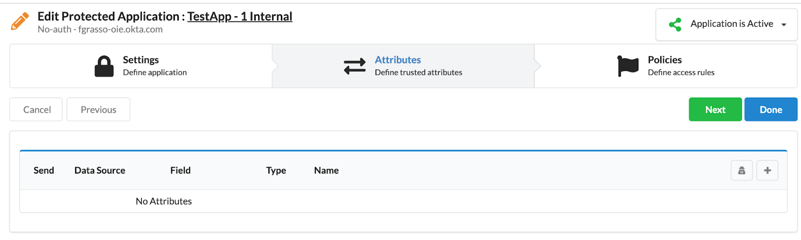
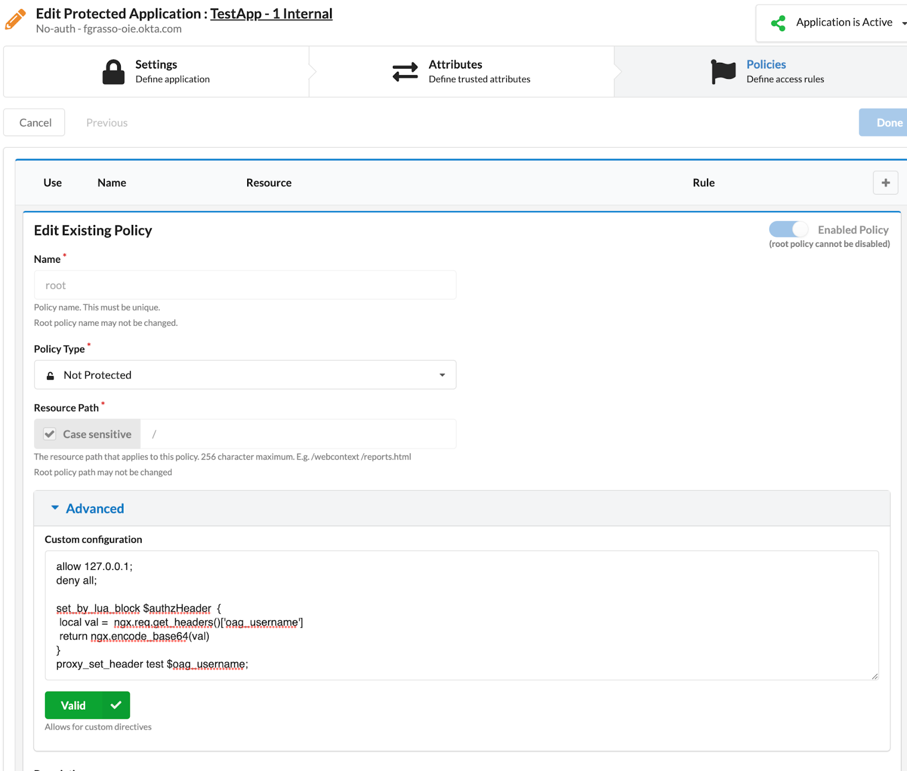
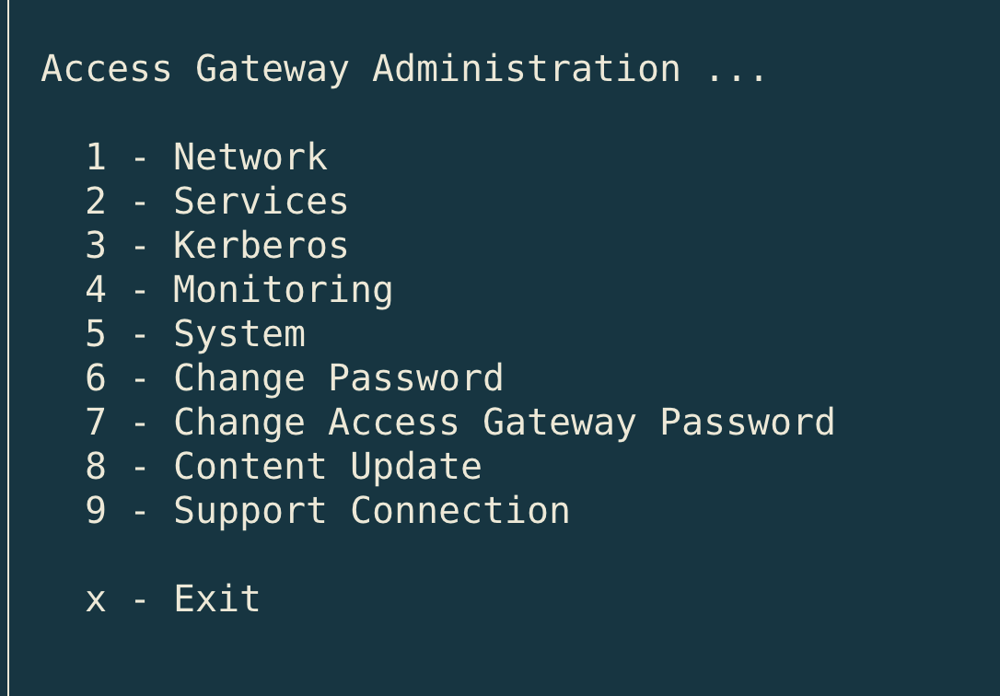
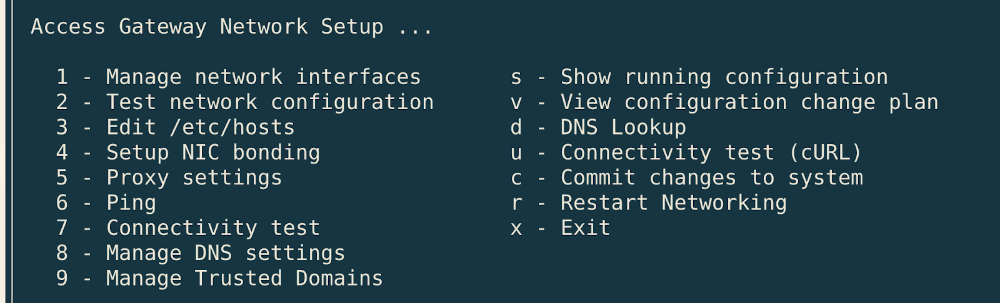
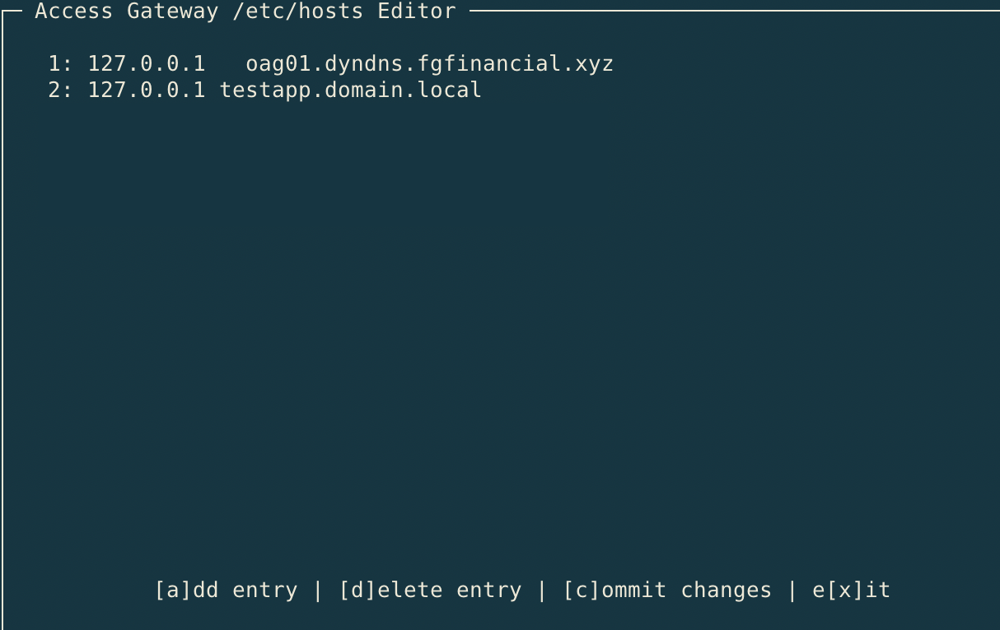

## Use case

OAG - Okta Access Gateway, doesn't provide an out of the box way to encode in Base64 the header to be sent to an internal application. However, it is quite common for legacy applications to require Base64-encoded data (e.g., the username of the authenticated user). This guide takes advantage of the ability to edit the OAG nginx configuration to create a simple function that allows you to manage Base64 encoding.

## Instructions

To make it work, we need to create an "internal-only" application in  OAG.

In this case, Public Domain must be an internal-only address not exposed to the internet (i.e. `testapp.domain.local`)

### Internal Application

#### Settings

- Type: `No-Auth`
- Name: `TestApp - 1 Internal`
- Public Domain: `https://testapp.domain.local/`



#### Attributes - None



#### Policies

- Policy Type: `Not Protected`
- Advanced: copy the following custom code...



#### Custom Code

⚠️ Important: Start with this code to deny access from internet. This host must be reachable only by the OAG.

```nginx
allow 127.0.0.1;
deny all;
```

Sample code using LUA for one field (i.e. Username) in the AUTHORIZATION header:

```nginx
set_encode_base64 $authzHeader $http_oag_username;
proxy_set_header AUTHORIZATION $authzHeader;
```

Alternative code combining two fields (i.e. First Name + Last Name) in the AUTHORIZATION header:

```nginx
set $val "${http_FirstName}${http_FirstLastName}";
set_encode_base64 $authzHeader $val;
proxy_set_header AUTHORIZATION $authzHeader;
```

As you noted, we are using the [set_encode_base64](https://github.com/openresty/set-misc-nginx-module?tab=readme-ov-file#set_encode_base64) function of nginx. This function is included in the OpenResty module [set-misc](https://github.com/openresty/set-misc-nginx-module)

### OAG Configuration

1. Open an SSH session
2. Select <kbd><kbd>1</kbd></kbd>  `Network` and then <kbd><kbd>3</kbd></kbd> `Edit /etc/hosts`
   
   
3. Select <kbd><kbd>a</kbd></kbd>  (`[a]dd entry`)
4. Enter IP address: `127.0.0.1`
5. Enter Host(s): `testapp.domain.local` (the “Public Domain” of the internal application)
   
6. Confirm by pressing key <kbd><kbd>c</kbd></kbd> (`[c]ommit changes`)

   Then press <kbd><kbd>x</kbd></kbd> (`e[x]it`)

   Press again <kbd><kbd>c</kbd></kbd> (`c - commit changes to the system`)

   And finally <kbd><kbd>x</kbd></kbd> (`exit`)

### Test the configuration

[TODO]

### Lua alternative

ℹ️ Note: It is also possible to use [Lua](https://www.lua.org/). In fact, OAG uses [OpenResty](https://openresty.org/) (an extension of nginx, which supports [LuaJIT](https://luajit.org/), a Just-In-Time Compiler for [Lua](https://www.lua.org/)). However, for this simple use case, it is sufficient to use the native nginx functions.

As a reference example, here is the Lua version for Base64 encoding:

Single field (username):

```nginx
set_by_lua_block $authzHeader  {
 local val =  ngx.req.get_headers()['oag_username']
 return ngx.encode_base64(val)
}

proxy_set_header AUTHORIZATION $authzHeader;
```

Joint of two fields (First Name + Last Name):

```nginx
set_by_lua_block $authzHeader  {
 local firstname =  ngx.req.get_headers()['FirstName']
 local laststname =  ngx.req.get_headers()['LastName']
 local val =  firstname..lastname 
 return ngx.encode_base64(val)
}

proxy_set_header AUTHORIZATION $authzHeader;
```