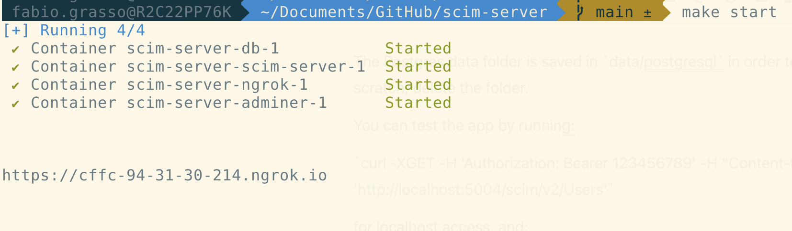
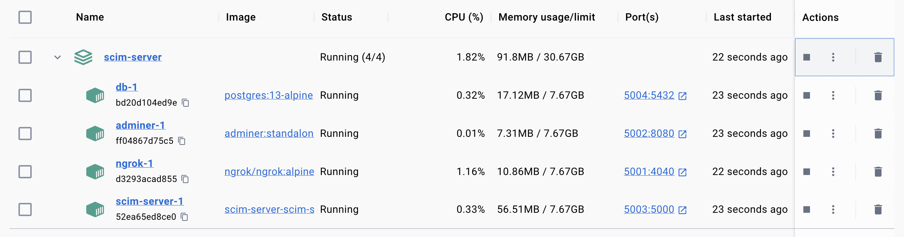
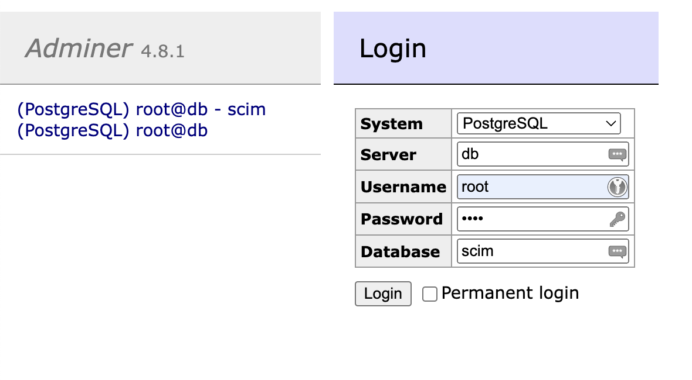
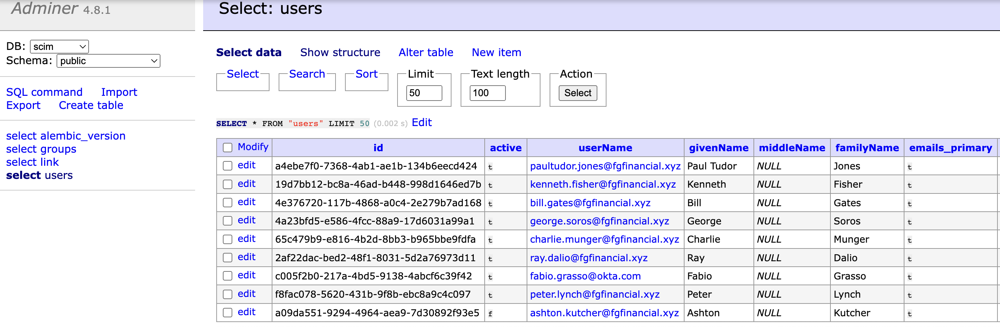
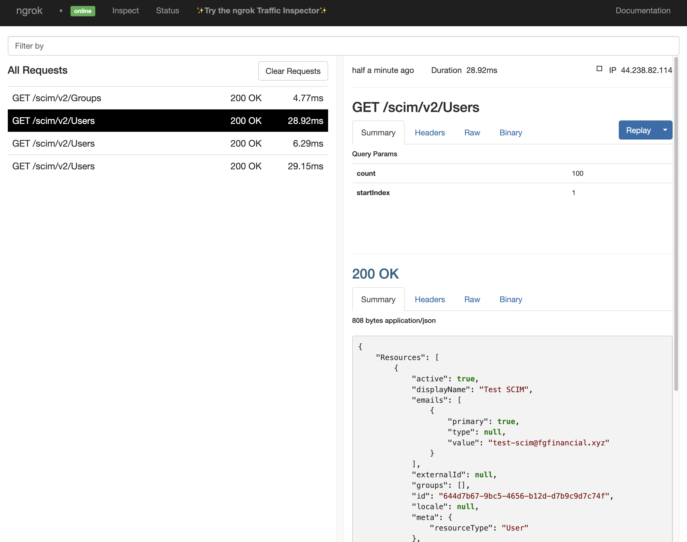

This project is based on [okta-scim-flask-example](https://github.com/oktadev/okta-scim-flask-example) and the guidance of the Okta blog post [How to Build a Flask SCIM Server Configured for Use with Okta](https://developer.okta.com/blog/2021/09/01/flask-scim-server).

There are some issues with running the Flesk server in an environment with Python >3.10. As it's not easy to prepare an environment with the right version of Python and the relative dependencies, I used a Docker Compose in order to make very quick the startup of the SCIM Server.

* Quick Instruction
  Clone  the repository at [GitHub - fabiograsso/okta-lab-scim-server](https://github.com/fabiograsso/okta-lab-scim-server): Okta SCIM Server with Docker Compose  (or download [https://github.com/fabiograsso/okta-lab-scim-server/archive/refs/heads/main.zip](https://github.com/fabiograsso/lab-okta-scim-server-docker-compose/archive/refs/heads/main.zip))
* ⚠️ Before running the server, edit file `config/ngrok.yml` with the ngrok Authtoken (otherwise the ngrok session will be limited to 2 hours)
* To start the SCIM Server, execute the following:
  \`make start\`
  The ngrok URL is outputted in the console after the startup. Then you can follow the instruction of the blog post, [How to Build a Flask SCIM Server Configured for Use with Okta](https://developer.okta.com/blog/2021/09/01/flask-scim-server), to create and configure the application in Okta.

Remember that the free version of ngrok uses dynamic URLs, so at every execution of the server, the public URL will change and must be updated in the Okta configuration.

Note: [Port 5000 is already in use on OSX](https://developer.apple.com/forums/thread/700989), so I used the following ports:

| URL/PORT                                        | Description                                        |
| ----------------------------------------------- | -------------------------------------------------- |
| [http://localhost:5001](http://localhost:5001/) | ngrok console (useful to see the SCIM commands)    |
| [http://localhost:5002](http://localhost:5002/) | Adminer (for managing the PostgreSQL content)      |
| [http://localhost:5003](http://localhost:5003/) | Okta SCIM Server (for local debugging and testing) |
| postgresql://localhost:5004                     | PostgreSQL Database                                |

The Postgres data folder is saved in `data/postgresql` in order to make the db persistent. To start from scratch, delete the folder.

You can test the app by running:

`curl -XGET -H 'Authorization: Bearer 123456789' -H "Content-type: application/json" 'http://localhost:5003/scim/v2/Users'`

for localhost access, and:

`curl -XGET -H 'Authorization: Bearer 123456789' -H "Content-type: application/json" 'https://xyz.ngrok-free.app/scim/v2/Users'`

for public access (remember to change the ngrok URL with your)

Additional info is in the [GitHub repository readme file](https://github.com/fabiograsso/okta-scim-server-docker-compose#readme).

## Prerequisites

Docker and Docker Compose

## Usage

A Makefile is present in order to create some shortcuts for common operations.

Usage:

| Command             | Description                              |
| ------------------- | ---------------------------------------- |
| `make start`        | Start docker-compose (in background)     |
| `make stop`         | Stop docker-compose                      |
| `make restart`      | Restart docker-compose                   |
| `make logs`         | Show the last 500 logs and start tail -f |
| `make start-logs`   | Start docker-compose with logs           |
| `make restart-logs` | Restart docker-compose with logs         |
| `make build`        | Rebuild all docker images                |

## Notes

This project is only for testing purposes. No kind of security is implemented (i.e. PostgreSQL runs with trust authentication enabled).

## Custom Images

### scim-server

Python 3.10 image with a copy of [okta-scim-flask-example](https://github.com/oktadev/okta-scim-flask-example).

I changed the DB hostname from `localhost` to `db` and created a `startup.sh` file, to run the database preparation scripts.

## Useful links
https://www.okta.com/video/scim-course-introduction/
https://developer.okta.com/blog/2023/07/28/scim-workshop
https://help.okta.com/oie/en-us/content/topics/apps/apps-about-scim.htm
https://developer.okta.com/docs/concepts/scim/ 

## Thanks to

* @Cale Switzer for the original project and source code
* @Pascale Kik for the idea & beta test

## Screenshot

