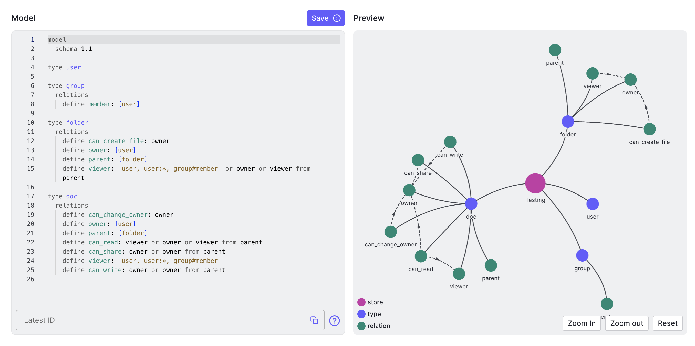
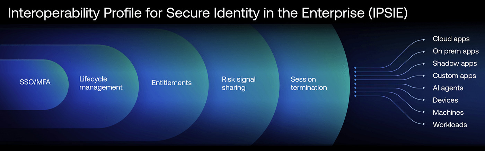
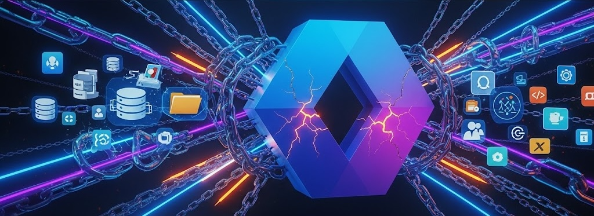
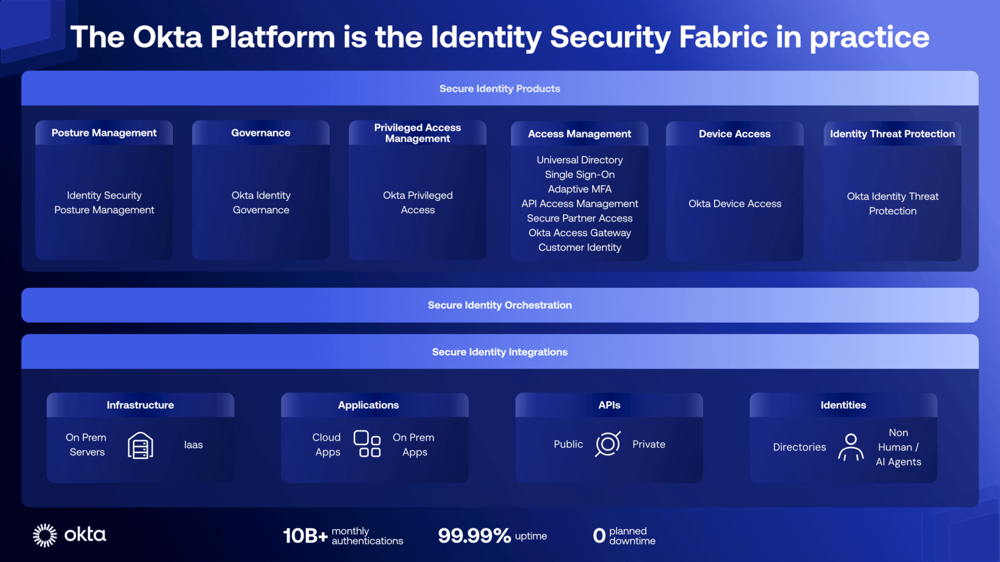

## Who watches the watchers in the digital identity era?

> «Pone seram, cohibe, sed quis custodiet ipsos custodes? Cauta est et ab illis incipit uxor.»
>
> **Decimus Iunius Iuvenalis, Satires**

*«Bolt the door, keep her in, but **who will watch the watchers themselves?** The wife is cunning and will start with them.»*

Originally referring to the difficulty of controlling marital infidelity, this famous *Latin phrase* by Roman poet *Juvenal* has become a timeless maxim about the nature of power, trust, and vigilance. The question "_Quis custodiet ipsos custodes?_" — _Who watches the watchers?_ — resonates powerfully today in the world of **cybersecurity**, prompting us to question who protects the systems that, in turn, protect us.

In an era where the security perimeter is no longer physical but virtual, digital identity has become the new bastion to protect. This brings us to a crucial paradox: can we truly entrust identity management to the same provider that hosts our infrastructure and services?

Recently, a client posed a deliberately provocative question: *"What's the point of Okta? My current provider can already give me everything: infrastructure, email, storage, Business Intelligence, device protection... and even identity management. Why should I spend more money on Okta when I can have everything practically free and integrated with what I already have?"* This statement, seemingly logical and innocuous, reveals a widespread perception: that **IAM (Identity and Access Management)** is a simple integrated feature, not a strategic choice. The debate isn't between two products, but between a centralized model and an independent, agnostic architecture.

---

## The Zero Trust Model

The traditional security model, based on the concept of "trusted perimeter," is now obsolete. In a world where people work remotely, access SaaS resources, and interact with APIs, implicit trust is a vulnerability. The answer to this challenge is the Zero Trust model, whose core philosophy is "never trust, always verify."

")

### Identity as the pillar of security

The [CISA's Zero Trust Maturity Model (ZTMM)](https://www.cisa.gov/zero-trust-maturity-model), a globally recognized framework, identifies **Identity** as **the first of the fundamental pillars** of this architecture. Identity is not just a component, but the primary control point upon which the entire security strategy is founded. To successfully implement this model, an organization needs a robust IAM system capable of:

- **Applying adaptive policies:** Dynamically adapting access policies based on context (user, device, location, time).
- **Using strong authentication:** Implementing intelligent, adaptive, and phishing-resistant multi-factor authentication (MFA).

Tools like **[FastPass](https://www.okta.com/fastpass/)**, **[Adaptive MFA](https://www.okta.com/multi-factor-authentication/)**, and **[Identity Threat Protection (ITP)](https://www.okta.com/products/identity-threat-protection/)** become essential for achieving these objectives, ensuring that only legitimate users and devices can interact with corporate resources.

### The foundations

If we then analyze the **foundations**, we find:

**Governance**: defines the rules and policies that guide the entire security strategy. It's not enough to implement the right tools; it's crucial to establish who can access what, under what conditions, and for how long.
  Solutions like **[Okta Identity Governance](https://www.okta.com/identity-governance/)** become vital in this context, as they ensure that access is always compliant with corporate policies and is revoked in a timely manner when no longer necessary. This approach not only strengthens security but also ensures regulatory compliance.

**Automation and Orchestration**: The effectiveness of a Zero Trust model depends on its ability to react quickly to context changes. Manually managing every single access request or every device state change would be impossible. Tools like **[Okta Workflows](https://www.okta.com/workflows/)** allow automation of identity and access management processes, eliminating the need for manual interventions, reducing human errors, and significantly improving operational efficiency. Automation allows the system to adapt in real-time, applying the "never trust, always verify" philosophy in a scalable way.

**Visibility and Analytics**: To make informed decisions and react to threats, an organization must have a clear and constant view of what's happening in its ecosystem. Platforms like **[Okta ISPM (Identity Security Posture Management)](https://www.okta.com/identity-security-posture-management/)** are designed to continuously analyze the health of identity security, providing valuable data and insights that help identify and mitigate risks before they can become serious problems. The ability to analyze data and visualize access patterns is the pivot on which the proactive reaction capability of the Zero Trust model is based.

### Better together: the other pillars

**Device**: The device represents the first point of contact and a potential vulnerability. Integration of IAM with Device Management ensures that only trusted devices, compliant with security policies, can access applications and data. Okta leverages standard technologies, such as SCEP (Simple Certificate Enrollment Protocol), to integrate with the most common Device Managers.
This protection is further reinforced by integrations with third-party tools like **EDR** (**Endpoint Detection and Response**) such as **[CrowdStrike](https://www.crowdstrike.com/)**, which constantly monitor the device's security status and report anomalies, blocking access in case of detected threats.
Additionally, **[Okta Desktop Access (ODA)](https://www.okta.com/desktop-access/)** allows implementing multi-factor authentication directly from the desktop, blocking operating system access.

**Networks**: The traditional network perimeter no longer exists. With cloud adoption and hybrid work, access to resources occurs from uncontrolled networks. Identity-based authentication and authorization extend to tools like VPNs and, more evolved, to **ZTA (Zero Trust Architecture)** systems, such as **[Zscaler](https://www.zscaler.com/)**. This approach ensures that access to specific network resources is not based only on geographic location or network of origin, but on the validity of the user's identity, their device, and the context of the request.

**Application & Workloads**: Applications are the beating heart of business activity and represent a primary target for attackers. Protection of this pillar is based on extending IAM to the applications themselves, ensuring that every access and operation is traceable, verified, and compliant with policies. **Single Sign-On (SSO)** and **Multi-Factor Authentication (MFA)** mechanisms for applications are fundamental to reducing the attack surface. Standardization through protocols like **SAML** and **OIDC (OpenID Connect)** allows centralizing identity management across all applications, internal and external, and controlling authorizations at a granular level.

")

This doesn't mean that every organization must immediately implement all pillars - a gradual approach is often more realistic.

### ABAC, ReBAC, DLP

**Data**: The final pillar recognizes that protecting the perimeter isn't enough: you need to protect the *data* itself. In this context, IAM evolves from a simple "door guardian" to an **intelligent content controller**.

Through technologies like **Attribute-Based Access Control (ABAC)** and **Fine-Grained Authorization** solutions like **[Okta/Auth0 FGA](https://www.okta.com/products/fine-grained-authorization/)** (and its open version **[OpenFGA](https://openfga.dev/)**), modern IAM can apply granular authorization policies that go beyond simple authentication.
The flexible authorization model of **FGA**, based on **Relationship-Based Access Control (ReBAC)**, makes it possible to implement data access policies that exactly reflect organizational structure and business processes.

Integration with **DLP (Data Loss Prevention)** systems allows blocking non-compliant operations in real-time, while **Identity Governance** ensures that access rights are automatically revoked when conditions change (role change, contract end, organizational modifications).

---

## Identity Fabric: The Architecture That Unifies Identities

While the Zero Trust model clearly defines **what** to protect and **how** to approach security, it doesn't automatically solve the problem of **coordination** between all involved systems. Without a unifying architecture, there's a risk of having a theoretically solid but practically fragmented Zero Trust model, where each component operates in isolation.

To overcome the fragmentation of these ecosystems, the concept of **Identity Fabric** emerges as the most effective architectural approach. Identity Fabric is not a single product, but a comprehensive framework that integrates and orchestrates all disparate IAM systems to function as a single unified system. This approach creates a coherent security "fabric" that extends across the entire corporate IT infrastructure, eliminating silos and security blind spots that emerge from a fragmented Zero Trust implementation.

**Okta is designed to serve as the central orchestrator in this Identity Fabric.** Thanks to its extensive integration capabilities, Okta connects and manages all identities, applications, and infrastructures (IaaS, on-prem, multi-cloud), regardless of the vendor. This *vendor-agnostic* approach not only ensures complete visibility and centralized control but also allows applying consistent security policies to all digital entities, human and non-human. In practice, it enables orchestrating identities and access in an agile, scalable, and secure way, adapting to a cloud-first and API-driven reality, bringing Zero Trust principles to a broader and more cohesive implementation level.

### IPSIE: The Importance of Open Standards

The true strength of an Identity Fabric lies not only in a single vendor's ability to orchestrate all components but in its **intrinsic interoperability** based on open standards. This principle is fundamental to ensuring that the architecture remains flexible and that organizations maintain the freedom to choose the best solutions for each specific need, without being tied to a single proprietary ecosystem.

**Okta actively supports this philosophy through the adoption of standard protocols** like SAML, OIDC, OAuth 2.0, and SCIM, and actively participates in the **[IPSIE (Identity Provider Security and Integration Ecosystem)](https://www.okta.com/blog/2024/10/oktas-mission-to-standardize-identity-security/)** initiative of the **OpenID Foundation[^2]**. This project aims to create the first unified security standard for enterprise identities, ensuring that different IAM solutions and other security products can communicate and collaborate without compromising security.

The open standards-based approach means that an organization can, for example, use **Okta** for **Identity Governance** while maintaining a different solution for **Access Management**, or exchange signals with third-party security tools like EDR, Antispam, ZTNA. This flexibility **democratizes identity security**, allowing each organization to build its own tailored Identity Fabric, combining the best available solutions on the market in a coherent and secure ecosystem.

---

## The Hidden Risk of the Integrated Provider

Choosing an IAM solution provided by the same vendor that manages your infrastructure and data in the cloud may seem convenient and economically advantageous, but it presents significant risks. Let's examine them in detail.

Deep integration with a single provider's proprietary ecosystem can trap companies in an almost irreversible **Vendor Lock-in**. Migration becomes a prohibitively expensive and time-consuming process, drastically limiting the flexibility to adopt new technologies or negotiate more advantageous economic conditions.

Moreover, when a provider controls both services and infrastructure and the security mechanism, an **intrinsic conflict of interest** emerges.
Their priorities might not be security or universal interoperability, but deep integration with their own ecosystem. This can lead to compromises, security shortcuts, and ultimately to a **lack of transparency and impartiality**.

Often, clients discover limitations of integrated solutions only when it's too late and becomes very expensive to change.

---

## The Advantages of Independent IAM

An **independent IAM** solution, like **Okta**, is designed to be neutral, interoperable, and modular. Choosing an independent platform offers the following advantages:

- **Flexibility and Agility**: With an extensive catalog of integrations, a *vendor-agnostic* solution allows companies to adopt a "best-of-breed" strategy, choosing the best tools for each business function and unifying identity management in a single secure platform.
  For example, it's possible to choose solutions from different providers for: Infrastructure (IaaS), Collaboration (email, files, instant messaging), EDR, Antispam, etc.
- **Neutrality and Open Standards**: Solutions like Okta are based on open standards (OAuth 2.0, OIDC, SAML, SCIM), avoiding proprietary logic. This neutrality favors portability, compliance, and interoperability between different ecosystems.
  This commitment manifests in the **[IPSIE](#ipsie-the-importance-of-open-standards)** initiative, which we discussed earlier.
- **No dependency on proprietary logic**: This approach completely eliminates any dependency on proprietary logic, ensuring that the system is flexible, interoperable, and future-proof. Independence from binding solutions allows organizations to choose technologies best suited to their needs without being limited by a single vendor's decisions. This favors innovation and adaptability in a continuously evolving technological landscape.
- **Resilience and Enhanced Governance**: An independent IAM doesn't limit itself to login. It offers Identity Governance (IGA) tools to manage identity lifecycle, Privileged Access Management (PAM) to protect sensitive accounts, and Identity Security Posture Management (ISPM) for continuous monitoring.

Okta engages in a continuous process of security improvement through investments in innovation, controls, and transparency. This is realized in the **[Okta Secure Identity Commitment](https://www.okta.com/secure-identity-commitment/)**, a long-term strategic initiative to lead the industry in fighting identity attacks. It articulates around four principles: **providing cutting-edge secure products**, **promoting best practices among customers**, **continuously strengthening internal corporate infrastructure**, and **elevating standards across the entire industry** (for example with [IPSIE](#ipsie-the-importance-of-open-standards)).

### Tangible ROI and Measurable Benefits

The advantages of an *Identity Fabric*-based IAM approach are not just theoretical. According to a recent study by **Forrester Consulting**[^1], organizations implementing **[Okta Identity Governance](https://www.okta.com/identity-governance/)** achieve a **211% ROI** over three years. Benefits include:

- **Operational cost reduction**: Automation of provisioning and deprovisioning activities with a 75% reduction in time needed to manage user access
- **Productivity improvement**: Users recover an average of 30 minutes per day thanks to SSO and reduced access friction
- **Compliance risk reduction**: 60% decrease in time needed for audits and compliance verification
- **Breach prevention**: The avoided cost of a single breach can far exceed the investment in the entire IAM platform

To explore the specific ROI potential for your organization, Okta provides a [dedicated calculator](https://www.okta.com/roi/) that considers the specific dimensions and characteristics of the company.

### IAM Maturity Assessment: Where Do You Stand?

Before undertaking transformation, it's essential to assess the current state. **[Okta's IAM maturity model](https://www.okta.com/resources/whitepaper-a-comprehensive-guide-for-your-identity-maturity-journey/)** identifies four progressive levels that define how Identity capabilities can contribute to achieving business objectives and organizational value:

1. **Fundamental**: Manual access management, shared passwords, no centralized visibility
2. **Scaling**: Basic process automation, SSO and MFA implementation across multiple applications
3. **Advanced**: Centralized policies, structured Governance, advanced Automation, access monitoring and integration with other systems. Identity integrates with the broader technology stack to improve efficiency for proactive security management, with optimized user experiences
4. **Strategic**: Identity is strategic: Complete automation, predictive analytics, implemented Zero Trust, AI for insights and recommendations. Identity becomes the primary control plane for access administration and a key element of cybersecurity strategy

Most organizations are between Stage 1 and 2, with significant improvement opportunities through adopting a modern IAM platform.

")

---

## A Balanced Assessment

While the advantages of an **Identity Fabric** are significant, it's important to recognize some challenges that organizations might encounter:

- **Initial setup complexity**: Implementing an independent solution requires more initial planning compared to activating an already integrated feature. However, this initial complexity translates into greater long-term flexibility and control.

- **Investment in skills**: The IT team must acquire familiarity with integration protocols (SAML, OIDC, SCIM) and IAM best practices. Okta mitigates this challenge through over 8,000 out-of-the-box integrations in the [OIN - Okta Integration Network](https://www.okta.com/integrations/) catalog, [extensive documentation](https://help.okta.com/en-us/content/index.htm), [free training](https://learning.okta.com/), and dedicated support during onboarding.

- **Additional licensing costs**: Unlike "*free*" integrated solutions, a specialized IAM platform has a licensing cost. However, as demonstrated by ROI data, this investment pays back quickly through operational efficiency and risk reduction.

The key is recognizing that these challenges are **temporary and mitigable**, while the advantages of an agnostic IAM, based on an Identity Fabric architecture, are **structural and lasting**.

### For small and medium enterprises

Even if the integrated approach may seem appealing to reduce initial costs and complexity, experience shows that in the long run it doesn't pay off, especially in terms of ROI and breach risk. Small businesses are often the most vulnerable targets precisely because they perceive security as a cost rather than an investment.

Okta offers [specific solutions for small businesses](https://www.okta.com/solutions/small-business/) that make enterprise IAM accessible even to smaller organizations.

Okta has a **scalable pricing model** that grows with the company, allowing you to start with essential functionalities and extend them in the future.

This approach allows SMEs to implement enterprise security best practices from the beginning, avoiding costly future migrations and protecting themselves from increasingly sophisticated threats that make no distinction between large and small organizations.

---

## Conclusions: Identity as an Impartial Arbiter

In today's digital landscape, identity is the new security perimeter. The choice of an IAM platform is not merely a technical decision, but a fundamental strategic choice. Relying on a single provider for infrastructure, data, and identity may appear advantageous, but true security is founded on separation of powers, transparency, and freedom of choice.

Adopting an **independent IAM** solution, configured as a true **Identity Fabric**, means implementing an architecture that ensures unified and secure identity management. This approach reduces risks, increases flexibility, and fully supports a Zero Trust strategy.

As we quoted at the beginning: *"Who watches the watchers?"*. **IAM must operate as an impartial arbiter, not as a player on the field.**

Authentic security derives from separation of powers: **those responsible for protection cannot be those who control every aspect of infrastructure and data.** An **independent IAM architecture** is not only more secure but is also intrinsically more **resilient, scalable, and free**.

As an **Okta Solutions Engineer**, I see the benefits of this approach daily. This is why I believe **Okta** represents the best implementation of this philosophy.

---

## ✋ Your Experience Matters

📊 **Assess your current state**: Before undertaking any IAM transformation, it's essential to take stock of the situation. Okta offers a free **Secure Identity Discovery Assessment** that analyzes your current identity security risks through *12 key questions*, providing targeted recommendations from Okta experts. [Contact me](/contacts) to learn more.

📈 **Calculate your ROI**: Use the **[Okta ROI calculator](https://www.okta.com/roi/)** to evaluate specific economic benefits for your organization. On average, Okta customers reduce maintenance and development costs by 60%.

📣 **Share your experience in the comments**: What's your approach to IAM solutions? Have you ever faced the dilemma between integrated and independent solutions?

🤝 **Discover Identity Fabric**: If you're interested in understanding how it can protect your company, [contact me](/contacts) for personalized consultation.

[^1]: [The Total Economic Impact™ Of Okta Identity Governance](https://www.okta.com/blog/2025/07/new-forrester-study-reveals-okta-identity-governance-can-result-in-211-roi/), Forrester, 2025
[^2]: [The Interoperability Profiling for Secure Identity in the Enterprise (IPSIE) Work Group](https://openid.net/wg/ipsie/), OpenID Foundation, 2024
