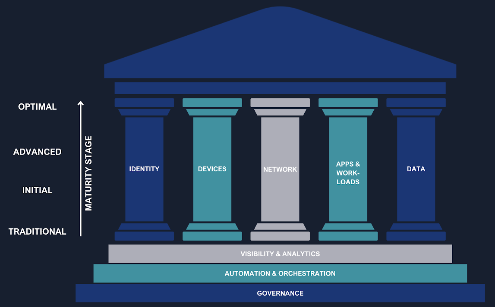
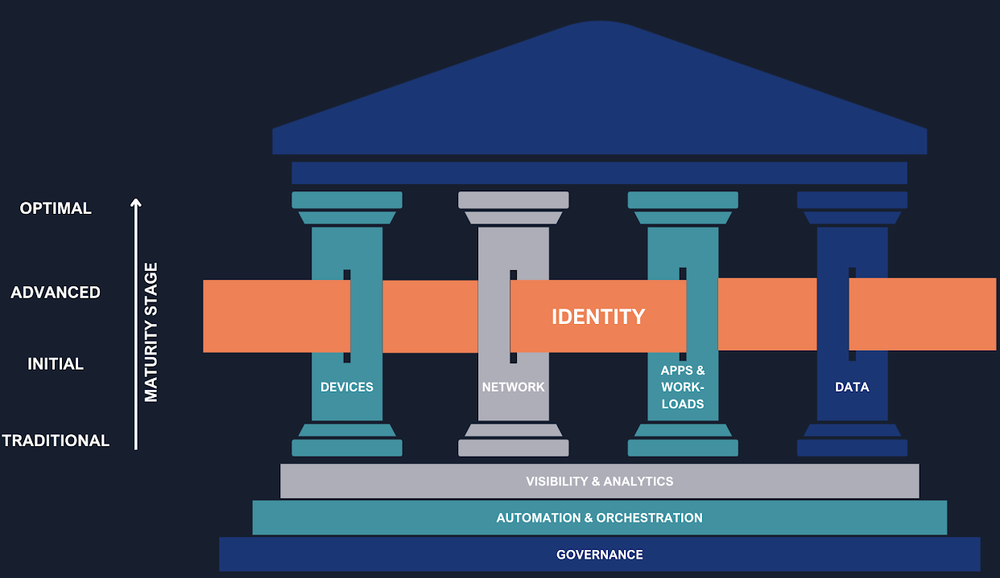
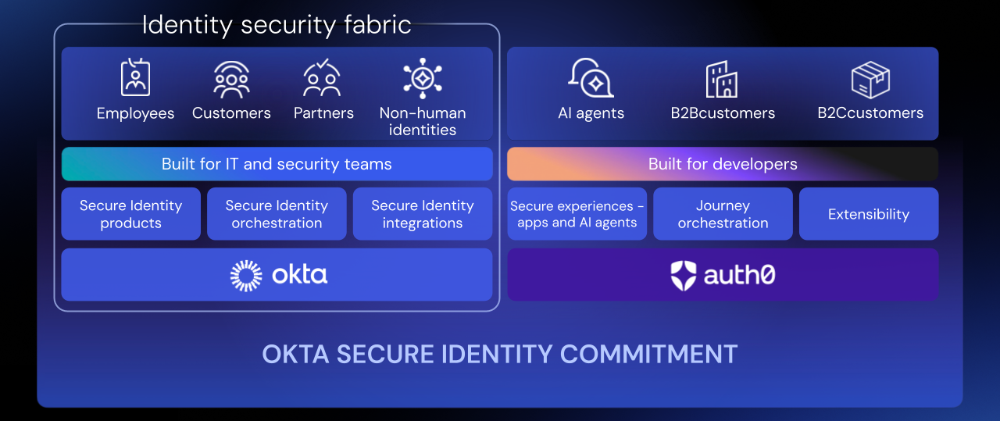

## Who Watches the Watchers in the Age of Digital Identity?

> «Pone seram, cohibe, sed quis custodiet ipsos custodes? Cauta est et ab illis incipit uxor.»
>
> *Decimus Junius Juvenalis, Satires, VI, 347-348*

*"Lock up and bar the doors, but **who watches the watchers?** The wife is shrewd and will start with them."*

Originally referring to the difficulty of controlling marital infidelity, this reflection by the Roman poet Juvenal has become a timeless maxim on the nature of power, trust, and vigilance. The question "_Quis custodiet ipsos custodes?_" — _Who watches the watchers? (or _who will guard the guards?_)_ — resonates strongly today in the world of **cybersecurity**, pushing us to question who protects the systems that, in turn, protect us.

In an era where the security perimeter is no longer physical but virtual, digital identity has become the new bastion to protect. This brings us to a crucial paradox: can we truly entrust the management of identities to the same provider that hosts our infrastructure and services?

Recently, a client asked me a deliberately provocative question: *"What is Okta for? My current provider can already give me everything: infrastructure, email, storage, Business Intelligence, device protection... and even identity management. Why should I spend more money on Okta when I can get everything practically for free and integrated with what I already have?".* This statement, seemingly logical and harmless, reveals a widespread perception: that **IAM (Identity and Access Management)** is a simple integrated feature, not a strategic choice. The debate is not between two products, but between a centralized model and an independent, agnostic architecture.

## Zero Trust: Identity as the Pillar of Security

The traditional security model, based on the concept of a "trusted perimeter," is now obsolete. In a world where we work remotely, access SaaS resources, and interact with APIs, implicit trust is a vulnerability. The answer to this challenge is the Zero Trust model, whose core philosophy is "never trust, always verify."

The [CISA's Zero Trust Maturity Model (ZTMM)](https://www.cisa.gov/zero-trust-maturity-model), a globally recognized framework, identifies **identity as the first of the fundamental pillars** of this architecture. Identity is not just a component, but the primary control point on which the entire security strategy is based. To successfully implement this model, an organization needs a robust IAM system capable of:

- **Applying adaptive policies:** Dynamically adapting access policies based on context (user, device, location, time).
- **Using strong authentication:** Implementing intelligent, adaptive, and phishing-resistant multi-factor authentication (MFA).

Tools like **FastPass**, **Adaptive MFA and Identity Threat Protection (ITP)** become essential to achieve these goals, ensuring that only legitimate users and devices can interact with company resources.

If we then analyze the **foundations** we find:

- **Governance**: Defines the rules and policies that guide the entire security strategy. It's not enough to implement the right tools; it's crucial to establish who can access what, under what conditions, and for how long.
  Solutions like **Okta Identity Governance** become vital in this context, as they ensure that access is always compliant with company policies and is revoked promptly when no longer needed. This approach not only strengthens security but also ensures regulatory compliance.
- **Automation and Orchestration**: The effectiveness of a Zero Trust model depends on its ability to react quickly to changes in context. Manually managing every single access request or device status change would be impossible. Tools like **Okta Workflows** allow for the automation of identity and access management processes, eliminating the need for manual intervention, reducing human error, and significantly improving operational efficiency. Automation allows the system to adapt in real-time, applying the "never trust, always verify" philosophy in a scalable way.
- **Visibility and Analytics**: To make informed decisions and react to threats, an organization must have a clear and constant view of what is happening in its ecosystem. Platforms like **Okta ISPM (Identity Security Posture Management)** are designed to continuously analyze the health of identity security, providing valuable data and insights that help identify and mitigate risks before they can become serious problems. The ability to analyze data and visualize access patterns is the cornerstone of the Zero Trust model's proactive response capability.

As for the other "pillars":

- **Device**: The device from which a user attempts to access corporate resources represents the first point of contact and a potential vulnerability. Integrating IAM with Device Management ensures that only trusted devices, compliant with security policies, can access applications and data. In addition, **Okta Desktop Access (ODA)** allows for the implementation of multi-factor authentication directly from the desktop, linking the user's identity to the device. This protection is further strengthened by integrations with third-party tools such as **EDRs** (**Endpoint Detection and Response**) like **CrowdStrike**, which constantly monitor the device's security status and report anomalies, blocking access in case of detected threats.
- **Networks**: The traditional network perimeter no longer exists. With the adoption of the cloud and hybrid work, access to resources occurs from uncontrolled networks. The integration of IAM with network security systems is therefore crucial. Identity-based authentication and authorization extend to tools like VPNs and, more advanced, to **ZTA (Zero Trust Architecture)** systems, such as **Zscaler**. This approach ensures that access to specific network resources is not based on geographic location or the source network, but on the validity of the user's identity, their device, and the context of the request.
- **Application & Workloads**: Applications and workloads are the lifeblood of business activity and represent a primary target for attackers. The protection of this pillar is based on extending IAM to the applications themselves, ensuring that every access and operation is traceable, verified, and compliant with policies. **Single Sign-On (SSO)** and **Multi-Factor Authentication (MFA)** mechanisms for applications are fundamental to reducing the attack surface. Integration with third-party tools and standardization through protocols like **SAML** and **OIDC (OpenID Connect)** allow for the centralization of identity management across all applications, internal and external, and for controlling permissions at a granular level.
- **Data**: Ultimately, the purpose of all security pillars is to protect data. Integrating IAM with Data Protection Policies and data security tools, such as **DLP (Data Loss Prevention)** systems, allows for the application of identity-based access policies directly to data, regardless of where it is located (in-rest or in-transit). This ensures that only authorized users can access sensitive data, with specific permissions based on their role and context. Furthermore, it prevents data leakage, even unintentional, by blocking operations that do not comply with policies.

## Identity Fabric: The Architecture That Unites Identities

To overcome the complexity and fragmentation of these ecosystems, the concept of an **Identity Fabric** emerges as the most effective architectural approach. The Identity Fabric is not a single product, but a complete framework that integrates and orchestrates all disparate IAM systems to function as a single, unified system. This approach creates a coherent security "fabric" that extends across the entire corporate IT infrastructure, eliminating silos and security blind spots.

**Okta is designed to act as the central orchestrator in this Identity Fabric.** Thanks to its extensive integration capabilities, Okta connects and manages all identities, applications, and infrastructures (IaaS, on-prem, multi-cloud), regardless of the provider. This agnostic approach not only ensures complete visibility and centralized control but also allows for the application of consistent security policies to all digital entities, both human and non-human. In practice, it enables agile, scalable, and secure orchestration of identities and access, adapting to a cloud-first and API-driven reality, and taking Zero Trust principles to a broader and more cohesive level of implementation.

## The Hidden Risk of the Integrated Provider

Choosing an IAM solution provided by the same vendor that manages your infrastructure and data in the cloud may seem convenient and cost-effective, but it presents significant risks. Let's look at them in detail.

1. **Single Point of Failure (SPoF)**: Relying on a single provider for both IT infrastructure and identity management exposes you to a dangerous concentration of security risk. If an attacker manages to compromise the provider, the entire corporate stack is at risk: user and asset identities, their access, applications, and sensitive data. A breach of the integrated IAM (Identity and Access Management) system, in particular, grants the attacker the "*keys to the kingdom,*" allowing them to move laterally and access all critical resources and information within the corporate ecosystem, with potentially devastating consequences in terms of data theft, operational disruption, and reputational damage.
2. **Vendor Lock-in**: Deep integration with a single provider's proprietary ecosystem can trap companies in an almost irreversible lock-in. Migration becomes a prohibitively expensive and time-consuming process, drastically limiting the flexibility to adopt new technologies or negotiate more favorable economic terms.
3. **Conflict of Interest and Lack of Impartiality**: When a provider controls both the services and the security mechanism, an intrinsic conflict of interest arises. Its priorities may not be security or universal interoperability, but deep integration with its own ecosystem. This can lead to security compromises, protection shortcuts, and ultimately, a lack of transparency.

## The Advantages of IAM Agnosticism

An **agnostic IAM** solution, like **Okta**, is designed to be neutral, interoperable, and modular. Choosing an independent platform offers the following advantages:

- **Flexibility and Agility**: With an extensive catalog of integrations, an agnostic solution allows companies to adopt a "best-of-breed" strategy, choosing the best tools for each business function and unifying identity management on a single, secure platform.
  For example, it's possible to choose solutions from different providers for: Infrastructure (IaaS), Collaboration (email, files, instant messaging), EDR, Antispam, etc.
- **Neutrality and Open Standards**: Agnostic solutions are based on open standards (OAuth 2.0, OIDC, SAML, SCIM), avoiding proprietary logic. This neutrality promotes portability, compliance, and interoperability between different ecosystems.
  This commitment is manifested in the IPSIE (Identity Provider Security and Integration Ecosystem) initiative, promoted in collaboration with the OpenID Foundation. The goal is to create the first unified security standard for corporate identities, an initiative that aims to democratize security and ensure interoperability for the benefit of the entire industry.
- **No Dependence on Proprietary Logic**: This approach completely eliminates any dependence on proprietary logic, ensuring that the system is flexible, interoperable, and future-proof. Independence from binding solutions allows organizations to choose the technologies best suited to their needs without being limited by the decisions of a single provider. This fosters innovation and adaptability in a constantly evolving technological landscape.
- **Resilience and Strengthened Governance**: An agnostic IAM is not limited to login. It offers Identity Governance (IGA) tools to manage the identity lifecycle, Privileged Access Management (PAM) to protect sensitive accounts, and Identity Security Posture Management (ISPM) for continuous monitoring.

Okta is committed to a continuous process of security improvement through investments in innovation, controls, and transparency.

### Tangible ROI and Measurable Benefits

The benefits of an agnostic IAM approach are not just theoretical. According to a [recent study by Forrester Consulting](https://www.okta.com/blog/2025/07/new-forrester-study-reveals-okta-identity-governance-can-result-in-211-roi/), organizations that implement Okta Identity Governance achieve a **211% ROI** in three years. The benefits include:

- **Reduction in operational costs**: Automation of provisioning and deprovisioning tasks with a 75% reduction in the time needed to manage user access
- **Improved productivity**: Users save an average of 30 minutes per day thanks to SSO and reduced access friction
- **Reduced compliance risks**: A 60% decrease in the time required for audits and compliance checks
- **Breach prevention**: The avoided cost of a single breach can far exceed the investment in the entire IAM platform

To explore the potential ROI for your organization, Okta provides a [dedicated calculator](https://www.okta.com/roi/) that considers the specific size and characteristics of the company.

### Concrete Evidence: When the Integrated Approach Fails

Recent history offers tangible examples of the risks associated with excessive concentration in a single provider. An emblematic case is the breach that hit SolarWinds in 2020, where the compromise of a single component in the ecosystem allowed attackers to infiltrate thousands of client organizations. This event demonstrated how blind trust in a single point of control can turn into a catastrophic single point of failure.

More recently, significant outages of integrated cloud services have paralyzed organizations for hours, which had entrusted their entire technology stack, including identity management, to a single provider. When the integrated IAM system stops working, the entire organization finds itself literally "locked out" of its own digital resources.

### Case Study: Digital Transformation with an Agnostic Approach

A concrete example of success is an Italian manufacturing company with 5,000 employees that migrated from an integrated IAM solution to Okta. The results achieved in 18 months include:

- **40% reduction in security incidents** related to unauthorized access
- **65% improvement in the onboarding speed** of new employees (from 3 days to 1 day)
- **Standardization of access** across 120+ SaaS and on-premises applications previously managed in a fragmented way
- **Automated compliance** with GDPR requirements with complete audit trails and automation of data deletion requests

The company was able to maintain its existing multi-cloud infrastructure (AWS for development, Azure for production, Google Cloud for analytics) by unifying identity management without vendor lock-in constraints.

## Practical Implementation: From Strategy to Execution

### Realistic Implementation Timeline

Adopting an agnostic IAM solution requires careful planning. A typical timeline for a medium-sized organization includes:

**Phase 1 - Discovery and Assessment (4-6 weeks)**
- Audit of existing applications and systems
- Mapping of current identities and access
- Assessment of current IAM maturity using frameworks like the [Comprehensive Guide for Your Identity Maturity Journey](https://www.okta.com/resources/whitepaper-a-comprehensive-guide-for-your-identity-maturity-journey/)

**Phase 2 - Proof of Concept (2-4 weeks)**
- Pilot implementation on a subset of critical applications
- Integration testing with existing systems
- Validation of authentication and authorization flows

**Phase 3 - Gradual Rollout (12-16 weeks)**
- Progressive migration of applications in order of priority
- Training for users and the IT team
- Implementation of advanced security policies

**Phase 4 - Optimization (ongoing)**
- Continuous monitoring and refinement of policies
- Integration of new applications
- Evolution towards advanced features (Governance, PAM, ISPM)

### Change Management Considerations

The success of the implementation heavily depends on change management:

- **Stakeholder Engagement**: Identify champions in each department to facilitate adoption
- **Transparent Communication**: Explain the tangible benefits for end-users (SSO, password reduction, mobile access)
- **Progressive Training**: Provide dedicated support during the first weeks of use
- **Feedback Loop**: Collect and incorporate user feedback for continuous improvements

### IAM Maturity Assessment: Where Do You Stand?

Before embarking on the transformation, it is essential to assess the current state. The IAM maturity model identifies four levels:

1. **Initial Level**: Manual access management, shared passwords, no centralized visibility
2. **Managed Level**: Basic implementation of SSO and MFA, some automation
3. **Defined Level**: Centralized policies, structured governance, access monitoring
4. **Optimized Level**: Full automation, predictive analytics, Zero Trust implemented

Most organizations are between level 1 and 2, with significant opportunities for improvement through the adoption of a modern IAM platform.

## Addressing Common Counterarguments

### "Multi-vendor complexity increases risks"

This fear is understandable but misplaced. An agnostic IAM platform like Okta **reduces** complexity through:
- **Standardization**: All systems use the same authentication protocols (SAML, OIDC)
- **Unified Visibility**: A single dashboard to monitor access and security across all systems
- **Automation**: Elimination of fragmented manual management typical of vendor-specific environments

### "Integration costs outweigh the benefits"

The TCO (Total Cost of Ownership) analysis proves the opposite:
- **Hidden costs of integrated solutions**: Vendor lock-in, lack of negotiation power, functional limitations
- **ROI of the agnostic approach**: As shown by the Forrester study, the 211% ROI is realized through reduced operational costs, improved productivity, and breach prevention
- **Future flexibility**: Ability to adopt new technologies without having to overhaul the entire IAM stack

### "A single vendor simplifies support"

This perception hides a more complex reality:
- **Diluted responsibility**: With an integrated vendor, it is often difficult to identify where the problem lies (infrastructure vs. IAM)
- **Specialized support**: A dedicated IAM vendor offers specific expertise and targeted SLAs on identity security
- **Community and resources**: Specialized platforms like Okta offer active communities, extensive documentation, and dedicated resources

## Accessible Solutions for Every Business Size

### For Small and Medium-Sized Businesses

Although the integrated approach may seem appealing for reducing initial costs and complexity, experience shows that it doesn't pay off in the long run, especially in terms of ROI and the risk of breaches. Small businesses are often the most vulnerable targets precisely because they perceive security as a cost rather than an investment.

Okta offers [specific solutions for small businesses](https://www.okta.com/solutions/small-business/) that make enterprise-grade IAM accessible even to the smallest organizations:

- **Okta for Google Workspace**: [Available for free](https://www.okta.com/free/google/) to add advanced IAM capabilities to your existing Google ecosystem
- **30-day free trial**: Opportunity to test the entire platform with no commitment to evaluate the concrete benefits
- **Scalable pricing**: A licensing model that grows with the company, allowing you to start with essential features

This approach allows SMBs to implement enterprise security best practices from the start, avoiding costly future migrations and protecting themselves from increasingly sophisticated threats that do not distinguish between large and small organizations.

### Limitations of the Agnostic Approach: A Balanced Assessment

While the advantages of an agnostic IAM are significant, it is important to recognize some challenges that organizations might face:

**Initial setup complexity**: Implementing an agnostic solution requires more initial planning compared to activating an already integrated feature. However, this initial complexity translates into greater flexibility and control in the long term.

**Investment in skills**: The IT team needs to become familiar with integration protocols (SAML, OIDC, SCIM) and IAM best practices. Okta mitigates this challenge through extensive documentation, free training, and dedicated onboarding support.

**Additional licensing costs**: Unlike "free" integrated solutions, a specialized IAM platform has a license cost. However, as demonstrated by the ROI data, this investment pays for itself quickly through operational efficiency and risk reduction.

## Conclusions: Identity as the Impartial Referee

In today's digital landscape, identity is the new security perimeter. The choice of an IAM platform is not merely a technical decision, but a fundamental strategic choice. Relying on a single provider for infrastructure, data, and identity may seem advantageous on the surface, but true security is based on the separation of powers, transparency, and freedom of choice.

As we quoted at the beginning: *"Who watches the watchers?"*. **IAM must operate as an impartial referee, not as a player on the field.**

Adopting an **agnostic IAM** solution, which configures itself as a true Identity Fabric, means implementing an architecture that ensures unified and secure identity management. This approach reduces risks, increases flexibility, and fully supports a Zero Trust strategy.

Authentic security comes from the separation of powers: **the one in charge of protection cannot be the one who controls every aspect.** An **independent IAM architecture** is not only more secure, but it is also inherently more **resilient, scalable, and free**.

## ✋ And You?

📣 What is your experience with IAM solutions? Have you ever faced the dilemma between an integrated and an independent solution?

💬 Share your opinion in the comments and, if you are interested in understanding how an Identity Fabric can protect your company, do not hesitate to contact me privately to learn more.
