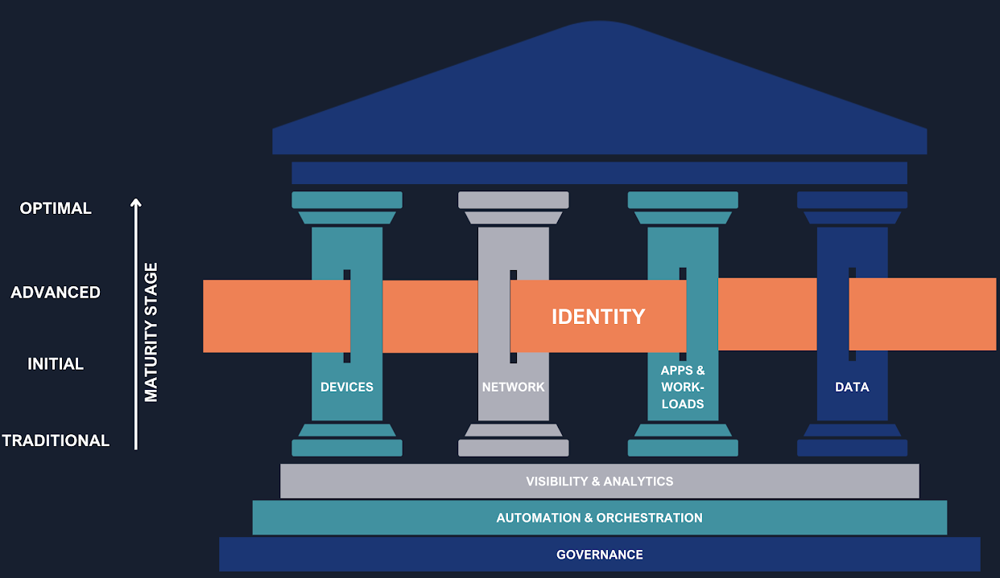
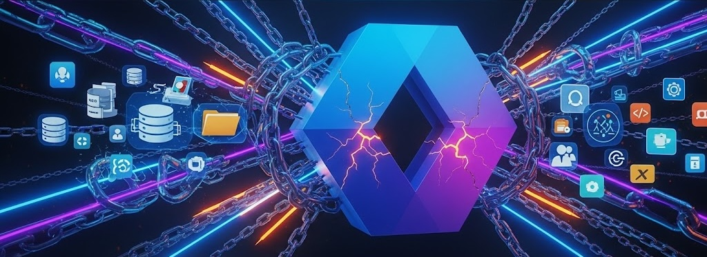
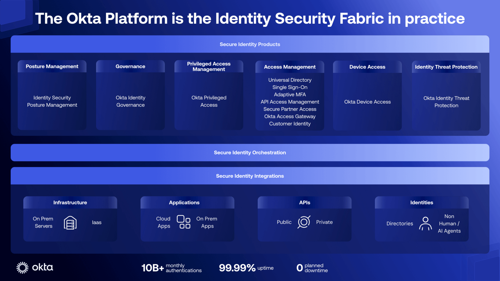

## I sorveglianti nell'era dell'identità digitale

> «Pone seram, cohibe, sed quis custodiet ipsos custodes? Cauta est et ab illis incipit uxor.»
> <cite>— Decimus Iunius Iuvenalis [^1]</cite>

[^1]: [Satire VI, O31-O32](https://it.wikipedia.org/wiki/Quis_custodiet_ipsos_custodes), Decimo Giunio Giovenale (Decimus Iunius Iuvenalis), 111

*«Spranga la porta, impedisci di uscire, ma **chi sorveglierà i sorveglianti?** La moglie è astuta e comincerà da quelli.»*

Originariamente riferita alla difficoltà di controllare l'infedeltà coniugale, questa famosa *locuzione latina* del poeta romano *Giovenale* è diventata una massima senza tempo sulla natura del potere, della fiducia e della vigilanza. La domanda "_Quis custodiet ipsos custodes?_" — _Chi sorveglia i sorveglianti?_ — risuona oggi con forza nel mondo della **cybersecurity**, spingendoci a interrogarci su chi protegge i sistemi che, a loro volta, proteggono noi.

In un'era in cui il perimetro di sicurezza non è più fisico, ma virtuale, l'identità digitale è diventata il nuovo baluardo da proteggere. Questo ci porta a un paradosso cruciale: possiamo davvero affidare la gestione delle identità allo stesso fornitore che ospita la nostra infrastruttura e i nostri servizi?

Di recente, un cliente mi ha posto una domanda volutamente provocatoria: *"A cosa serve Okta? Il mio fornitore attuale mi può dare già tutto: infrastruttura, posta elettronica, storage, Business Intelligence, protezione dei dispositivi... e anche la gestione delle identità. Perché dovrei spendere altri soldi per Okta quando posso avere tutto praticamente gratis e integrato in quello che già ho?".* Questa affermazione, apparentemente logica e innocua, rivela una percezione diffusa: che l'**IAM (Identity and Access Management)** sia una semplice funzionalità integrata, non una scelta strategica. Il dibattito non è tra due prodotti, ma tra un modello centralizzato e un'architettura indipendente e agnostica.

---

## Il modello Zero Trust

Il modello di sicurezza tradizionale, basato sul concetto di "trusted perimeter", è ormai superato. In un mondo dove si lavora da remoto, si accede a risorse SaaS e si interagisce con API, la fiducia implicita è una vulnerabilità. La risposta a questa sfida è il modello Zero Trust, la cui filosofia cardine è "non fidarsi mai, verificare sempre".

")

### L'Identità come pilastro della sicurezza

Il [CISA's Zero Trust Maturity Model (ZTMM)](https://www.cisa.gov/zero-trust-maturity-model), un framework riconosciuto a livello globale, identifica l'**Identità** come **il primo dei pilastri fondamentali** di questa architettura. L'identità non è solo un componente, ma il punto di controllo primario su cui si fonda l'intera strategia di sicurezza. Per implementare con successo questo modello, un'organizzazione ha bisogno di un sistema IAM robusto in grado di:

- **Applicare politiche adattive:** Adattare dinamicamente le politiche di accesso in base al contesto (utente, dispositivo, posizione, ora).
- **Utilizzare un'autenticazione forte:** Implementare un'autenticazione a più fattori (MFA) intelligente, adattiva e resistente al phishing.

Strumenti come **[FastPass](https://www.okta.com/fastpass/)**, **[Adaptive MFA](https://www.okta.com/multi-factor-authentication/)** e **[Identity Threat Protection (ITP)](https://www.okta.com/products/identity-threat-protection/)** diventano essenziali per realizzare questi obiettivi, garantendo che solo gli utenti e i dispositivi legittimi possano interagire con le risorse aziendali.

### Le fondamenta

Se analizziamo poi le **fondamenta** troviamo:

**Governance**: definisce le regole e le politiche che guidano l'intera strategia di sicurezza. Non basta implementare gli strumenti giusti, è cruciale stabilire chi può accedere a cosa, in quali condizioni e per quanto tempo.
  Soluzioni come **[Okta Identity Governance](https://www.okta.com/identity-governance/)** diventano vitali in questo contesto, in quanto permettono di assicurare che gli accessi siano sempre conformi alle politiche aziendali e che vengano revocati in modo tempestivo quando non sono più necessari. Questo approccio non solo rafforza la sicurezza, ma garantisce anche la conformità normativa.

**Automation and Orchestration**: L'efficacia di un modello Zero Trust dipende dalla sua capacità di reagire rapidamente ai cambiamenti di contesto. Gestire manualmente ogni singola richiesta di accesso o ogni cambiamento di stato dei dispositivi sarebbe impossibile. Strumenti come **[Okta Workflows](https://www.okta.com/workflows/)** consentono di automatizzare i processi di gestione delle identità e degli accessi, eliminando la necessità di interventi manuali, riducendo gli errori umani e migliorando notevolmente l'efficienza operativa. L'automazione permette al sistema di adattarsi in tempo reale, applicando la filosofia "non fidarsi mai, verificare sempre" in modo scalabile.

**Visibility and Analytics**: Per poter prendere decisioni informate e reagire alle minacce, un'organizzazione deve avere una visione chiara e costante di ciò che accade nel suo ecosistema. Piattaforme come **[Okta ISPM (Identity Security Posture Management)](https://www.okta.com/identity-security-posture-management/)** sono progettate per analizzare in modo continuo la salute della sicurezza delle identità, fornendo dati preziosi e insight che aiutano a identificare e mitigare i rischi prima che possano diventare problemi seri. La capacità di analizzare i dati e visualizzare i pattern di accesso è il perno su cui si basa la capacità di reazione proattiva del modello Zero Trust.

### Better together: gli altri pilastri

**Device**: Il dispositivo rappresenta il primo punto di contatto e una potenziale vulnerabilità. L'integrazione dell'IAM con il Device Management assicura che solo i dispositivi fidati, conformi alle policy di sicurezza, possano accedere alle applicazioni e ai dati. Okta sfrutta tecnologie standard, come SCEP (Simple Certificate Enrollment Protocol), per integrarsi con i Device Manager più diffusi. 
Questa protezione è ulteriormente rafforzata dalle integrazioni con strumenti di terze parti come gli **EDR** (**Endpoint Detection and Response**) come ad esempio **[CrowdStrike](https://www.crowdstrike.com/)**, che monitorano costantemente lo stato di sicurezza del dispositivo e segnalano anomalie, bloccando l'accesso in caso di minacce rilevate.
In aggiunga, **[Okta Desktop Access (ODA)](https://www.okta.com/desktop-access/)** permette di implementare un'autenticazione a più fattori direttamente dal desktop, bloccando l'accesso del sistema operativo. 

**Networks**: Il perimetro della rete tradizionale non esiste più. Con l'adozione del cloud e del lavoro ibrido, l'accesso alle risorse avviene da reti non controllate. L'autenticazione e l'autorizzazione basate sull'identità si estendono a strumenti come le VPN e, in modo più evoluto, ai sistemi **ZTA (Zero Trust Architecture)**, come ad esempio **[Zscaler](https://www.zscaler.com/)**. Questo approccio garantisce che l'accesso a risorse di rete specifiche non sia basato solo sulla posizione geografica o sulla rete di provenienza, ma sulla validità dell'identità dell'utente, del suo dispositivo e del contesto della richiesta.

**Application & Workloads**: Le applicazioni sono il cuore pulsante dell'attività aziendale e rappresentano un obiettivo primario per gli attaccanti. La protezione di questo pilastro si basa sull'estensione dell'IAM alle applicazioni stesse, garantendo che ogni accesso e operazione sia tracciabile, verificato e conforme alle policy. I meccanismi di **Single Sign-On (SSO)** e **Multi-Factor Authentication (MFA)** per le applicazioni sono fondamentali per ridurre la superficie di attacco. La standardizzazione tramite protocolli come **SAML** e **OIDC (OpenID Connect)** permettono di centralizzare la gestione delle identità su tutte le applicazioni, interne ed esterne, e di controllare le autorizzazioni a un livello granulare.

")

Questo non significa che ogni organizzazione debba implementare immediatamente tutti i pilastri - l'approccio graduale è spesso più realistico.

### ABAC, ReBAC, DLP

**Data**: Il pilastro finale riconosce che proteggere il perimetro non basta: bisogna proteggere i *dati* stessi. In questo contesto, l'IAM evolve da semplice "guardiano della porta" a **controllore intelligente dei contenuti**.

Attraverso tecnologie come l'**Attribute-Based Access Control (ABAC)** e soluzioni di **Fine-Grained Authorization** come **[Okta/Auth0 FGA](https://www.okta.com/products/fine-grained-authorization/)** (e la sua versione aperta **[OpenFGA](https://openfga.dev/)**, l'IAM moderno può applicare politiche autorizzative granulari che vanno oltre la semplice autenticazione.
Il modello autorizzativo flessibile di **FGA**, basato su **Relationship-Based Access Control (ReBAC)**, rende possibile implementare politiche di accesso ai dati che rispecchiano esattamente la struttura organizzativa e i processi aziendali.

L'integrazione con sistemi **DLP (Data Loss Prevention)** permette di bloccare in tempo reale operazioni non conformi, mentre l'**Identity Governance** assicura che i diritti di accesso vengano revocati automaticamente quando cambiano le condizioni (cambio ruolo, fine contratto, modifiche organizzative).

---

## Identity Fabric: il Tessuto che unisce le identità

Mentre il modello Zero Trust definisce chiaramente **cosa** proteggere e **come** approcciarsi alla sicurezza, non risolve automaticamente il problema del **coordinamento** tra tutti i sistemi coinvolti. Senza un'architettura unificante, si rischia di avere un modello Zero Trust teoricamente solido ma praticamente frammentato, dove ogni componente opera in isolamento.

Per superare la frammentazione di questi ecosistemi, il concetto di **Identity Fabric** emerge come l'approccio architetturale più efficace. L'Identity Fabric non è un singolo prodotto, ma un framework completo che integra e orchestra tutti i sistemi IAM disparati per funzionare come un unico sistema unificato. Questo approccio crea un "tessuto" di sicurezza coerente che si estende su tutta l'infrastruttura IT aziendale, eliminando i silos e i punti ciechi di sicurezza che emergono da un'implementazione frammentata dello Zero Trust..

**Okta è progettata per fungere da orchestratore centrale in questo Identity Fabric.** Grazie alle sue ampie capacità di integrazione, Okta connette e gestisce tutte le identità, applicazioni e infrastrutture (IaaS, on-prem, multi-cloud), indipendentemente dal fornitore. Questo approccio *vendor-agnostic* non solo garantisce una visibilità completa e un controllo centralizzato, ma permette anche di applicare politiche di sicurezza coerenti a tutte le entità digitali, umane e non umane. In pratica, consente di orchestrare identità e accessi in modo agile, scalabile e sicuro, adattandosi a una realtà cloud-first e API-driven, portando i principi Zero Trust a un livello di implementazione più ampio e coeso.

### IPSIE: L'importanza degli standard aperti

La vera forza di un Identity Fabric non risiede solo nella capacità di un singolo vendor di orchestrare tutti i componenti, ma nella sua **interoperabilità intrinseca** basata su standard aperti. Questo principio è fondamentale per garantire che l'architettura rimanga flessibile e che le organizzazioni mantengano la libertà di scegliere le migliori soluzioni per ogni specifica esigenza, senza essere vincolate a un unico ecosistema proprietario.

**Okta supporta attivamente questa filosofia attraverso l'adozione di protocolli standard** come SAML, OIDC, OAuth 2.0 e SCIM, e partecipa attivamente all'iniziativa **[IPSIE (Identity Provider Security and Integration Ecosystem)](https://www.okta.com/blog/2024/10/oktas-mission-to-standardize-identity-security/)** della **OpenID Foundation[^3]**. Questo progetto mira a creare il primo standard di sicurezza unificato per le identità aziendali, garantendo che diverse soluzioni IAM, e altri prodotti di sicurezza, possano comunicare e collaborare senza compromettere la sicurezza.

L'approccio basato su standard aperti significa che un'organizzazione può, ad esempio, utilizzare **Okta** per l'**Identity Governance** mantenendo una soluzione diversa per l'**Access Management**, oppure scambiare segnali con strumenti di sicurezza terzi come EDR, Antispam, ZTNA. Questa flessibilità **democratizza la sicurezza delle identità**, permettendo a ogni organizzazione di costruire il proprio Identity Fabric su misura, combinando le migliori soluzioni disponibili sul mercato in un ecosistema coerente e sicuro.

---

## Il rischio nascosto del fornitore integrato

Scegliere una soluzione IAM fornita dallo stesso vendor che gestisce la tua infrastruttura e i tuoi dati nel cloud può sembrare comodo ed economicamente conveniente, ma presenta rischi significativi. Vediamoli nel dettaglio.

La profonda integrazione con l'ecosistema proprietario di un singolo fornitore può intrappolare le aziende in un **Vendor Lock-in** quasi irreversibile. La migrazione diventa un processo proibitivamente costoso e dispendioso, limitando drasticamente la flessibilità di adottare nuove tecnologie o di negoziare condizioni economiche più vantaggiose.

Inoltre, quando un fornitore controlla sia i servizi e l'infrastruttura che il meccanismo di sicurezza, emerge un **conflitto di interessi intrinseco**.
Le sue priorità potrebbero non essere la sicurezza o l'interoperabilità universale, ma l'integrazione profonda con il proprio ecosistema. Questo può portare a compromessi, a scorciatoie nella protezione e, in ultima analisi, a una **mancanza di trasparenza e imparzialità**.

Spesso i clienti scoprono limitazioni delle soluzioni integrate solo quando è troppo tardi e diventa poi molto costoso cambiare.

---

## I vantaggi di un IAM indipendente

Una soluzione **IAM indipendete**, come **Okta**, è progettata per essere neutrale, interoperabile e modulare. Scegliere una piattaforma indipendente offre i seguenti vantaggi:

- **Flessibilità e Agilità**: Con un ampio catalogo di integrazioni, una soluzione *vendor-agnostic* permette alle aziende di adottare una strategia "*best-of-breed*", scegliendo i migliori strumenti per ogni funzione aziendale e unificando la gestione delle identità in un'unica piattaforma sicura.
  Ad esempio è possibile scegliere soluzioni di fornitori diversi per: Infrastruttura (IaaS), Collaboration (e-mail, file, instant messaging), EDR, Antispam, ecc.
- **Neutralità e Standard Aperti**: Soluzioni come Okta si basano su standard aperti (OAuth 2.0, OIDC, SAML, SCIM), evitando logiche proprietarie. Questa neutralità favorisce la portabilità, la compliance e l'interoperabilità tra ecosistemi diversi.
  Questo impegno si manifesta nell'iniziativa **[IPSIE](#ipsie-limportanza-degli-standard-aperti)**, di cui abbiamo parlato poco fa.
- **Nessuna dipendenza da logiche proprietarie**: Questo approccio elimina completamente qualsiasi dipendenza da logiche proprietarie, garantendo che il sistema sia flessibile, interoperabile e a prova di futuro. L'indipendenza da soluzioni vincolanti permette alle organizzazioni di scegliere le tecnologie più adatte alle proprie esigenze senza essere limitate dalle decisioni di un singolo fornitore. Ciò favorisce l'innovazione e la capacità di adattamento in un panorama tecnologico in continua evoluzione.
- **Resilienza e Governance Rafforzata**: Un IAM agnostico non si limita al login. Offre strumenti di Identity Governance (IGA) per gestire il ciclo di vita delle identità, il Privileged Access Management (PAM) per proteggere gli account sensibili e l'Identity Security Posture Management (ISPM) per un monitoraggio continuo.

Okta si impegna in un processo continuo di miglioramento della sicurezza attraverso investimenti in innovazione, controlli e trasparenza. Questo si concretizza nell'**[Okta Secure Identity Commitment](https://www.okta.com/secure-identity-commitment/)**, un'iniziativa strategica a lungo termine per guidare l'industria nella lotta contro gli attacchi alle identità. Si articola attorno a quattro principi: **fornire prodotti sicuri all'avanguardia**, **promuovere le migliori pratiche tra i clienti**, **rafforzare continuamente l'infrastruttura aziendale interna**, e **elevare gli standard dell'intera industria** (ad esempio con [IPSIE](#ipsie-limportanza-degli-standard-aperti)).

### ROI Tangibile e Benefici Misurabili

I vantaggi di un approccio IAM basato su *Identity Fabric* non sono solo teorici. Secondo uno studio recente di **Forrester Consulting**[^2], le organizzazioni che implementano **[Okta Identity Governance](https://www.okta.com/identity-governance/)** ottengono un **ROI del 211%** in tre anni. I benefici includono:

- **Riduzione dei costi operativi**: Automazione delle attività di provisioning e deprovisioning con una riduzione del 75% del tempo necessario per gestire gli accessi utente
- **Miglioramento della produttività**: Gli utenti recuperano mediamente 30 minuti al giorno grazie all'SSO e alla riduzione degli attriti di accesso
- **Riduzione dei rischi di compliance**: Diminuzione del 60% del tempo necessario per audit e verifiche di conformità
- **Prevenzione di violazioni**: Il costo evitato di una singola violazione può superare largamente l'investimento nell'intera piattaforma IAM

Per esplorare il potenziale ROI specifico per la tua organizzazione, Okta mette a disposizione un [calcolatore dedicato](https://www.okta.com/roi/) che considera le dimensioni e le caratteristiche specifiche dell'azienda.

### Valutazione della maturità IAM: dove ti trovi?

Prima di intraprendere la trasformazione, è essenziale valutare lo stato attuale. Il **[modello di maturità IAM di Okta](https://www.okta.com/resources/whitepaper-a-comprehensive-guide-for-your-identity-maturity-journey/)** identifica quattro livelli progressivi che definiscono come le capacità di Identity possano contribuire al raggiungimento degli obiettivi di business e al valore organizzativo:

1. **Fundamental**: Gestione manuale degli accessi, password condivise, nessuna visibilità centralizzata
2. **Scaling**: Automazione di base dei processi, implementazione di SSO e MFA su più applicazioni.
3. **Advanced**: Policy centralizzate, Governance strutturata, Automazione avanzata,monitoraggio degli accessi e integrazione con altri sistemi. Si integra l'Identity con il broader technology stack per migliorare l'efficienza per una gestione proattiva della sicurezza, con esperienze utente ottimizzate.
4. **Strategic**: L'identità è strategica: Automazione completa, analytics predittivi, Zero Trust implementato, AI per insights e raccomandazioni. L'Identity diventa il piano di controllo primario per l'amministrazione degli accessi e elemento chiave della strategia di cybersecurity.

La maggior parte delle organizzazioni si trova tra lo Stage 1 e 2, con significative opportunità di miglioramento attraverso l'adozione di una piattaforma IAM moderna.

")

---

## Una valutazione equilibrata

Sebbene i vantaggi di un **Identity Fabric** siano significativi, è importante riconoscere alcune sfide che le organizzazioni potrebbero incontrare:

- **Complessità iniziale di setup**: L'implementazione di una soluzione indipendente richiede una maggiore pianificazione iniziale rispetto all'attivazione di una funzionalità già integrata. Tuttavia, questa complessità iniziale si traduce in maggiore flessibilità e controllo a lungo termine.

- **Investimento in competenze**: Il team IT deve acquisire familiarità con protocolli di integrazione (SAML, OIDC, SCIM) e best practice IAM. Okta mitiga questa sfida attraverso più di 8000 integrazioni out of the box nel catalogo [OIN - Okta Integration Network](https://www.okta.com/integrations/), [documentazione estensiva](https://help.okta.com/en-us/content/index.htm), [training gratuiti](https://learning.okta.com/) e supporto dedicato durante l'onboarding.

- **Costi di licensing aggiuntivi**: A differenza delle soluzioni "*gratuite*" integrate, una piattaforma IAM specializzata ha un costo di licenza. Tuttavia, come dimostrato dai dati ROI, questo investimento si ripaga rapidamente attraverso efficienza operativa e riduzione dei rischi.

La chiave è riconoscere che queste sfide sono **temporanee e mitigabili**, mentre i vantaggi di un IAM agnostico, basato su un'architettura Identity Fabric, sono **strutturali e duraturi**.

### Per le piccole e medie imprese

Anche se l'approccio integrato può sembrare allettante per ridurre costi e complessità iniziali, l'esperienza dimostra che alla lunga non ripaga, soprattutto in termini di ROI e rischio di violazioni. Le piccole aziende sono spesso i bersagli più vulnerabili proprio perché percepiscono la sicurezza come un costo piuttosto che come un investimento.

Okta offre [soluzioni specifiche per le small business](https://www.okta.com/solutions/small-business/) che rendono l'IAM enterprise accessibile anche alle organizzazioni più piccole.

Okta ha un **modello di pricing scalabile**, che cresce con l'azienda, permettendo di iniziare con le funzionalità essenziali ed estenderle in futuro.

Questo approccio permette alle PMI di implementare best practice di sicurezza enterprise sin dall'inizio, evitando costose migrazioni future e proteggendosi da minacce sempre più sofisticate che non fanno distinzione tra grandi e piccole organizzazioni.

---

## Conclusioni: l'identità come arbitro imparziale

Nel panorama digitale odierno, l'identità è il nuovo perimetro di sicurezza. La scelta di una piattaforma IAM non è meramente una decisione tecnica, ma una scelta strategica fondamentale. Affidarsi a un unico fornitore per infrastruttura, dati e identità può apparire apparentemente vantaggioso, ma la vera sicurezza si fonda sulla separazione dei poteri, sulla trasparenza e sulla libertà di scelta.

Adottare una soluzione **IAM indipendente**, che si configuri come un vero e proprio **Identity Fabric**, significa implementare un'architettura che assicura una gestione delle identità unificata e sicura. Questo approccio riduce i rischi, incrementa la flessibilità e supporta pienamente una strategia Zero Trust.

Come abbiamo citato all'inizio: *"Chi sorveglia i sorveglianti?"*. **L'IAM deve operare come un arbitro imparziale, non come un giocatore in campo.**

La sicurezza autentica deriva dalla separazione dei poteri: **chi è preposto alla protezione non può essere colui che controlla ogni aspetto dell'infrastruttura e dei dati.** Un'**architettura IAM indipendente** non solo è più sicura, ma è anche intrinsecamente più **resiliente, scalabile e libera**.

Come **Solutions Engineer Okta**, vedo quotidianamente i benefici di questo approccio. Ecco perché credo che **Okta** rappresenti la migliore implementazione di questa filosofia.

---

## ✋ La tua esperienza conta

📊 **Valuta il tuo stato attuale**: Prima di intraprendere qualsiasi trasformazione IAM, è essenziale fare il punto della situazione. Okta offre un **Secure Identity Discovery Assessment** gratuito che analizza i tuoi attuali rischi di sicurezza delle identità attraverso *12 domande chiave*, fornendo raccomandazioni mirate da parte degli esperti Okta. [Contattami](/contacts) per saperne di più.

📈 **Calcola il tuo ROI**: Utilizza il **[calcolatore ROI di Okta](https://www.okta.com/roi/)** per valutare i benefici economici specifici per la tua organizzazione. In media, i clienti Okta riducono del 60% i costi di manutenzione e sviluppo.

📣 **Condividi la tua esperienza nei commenti**: Qual è il tuo approccio alle soluzioni IAM? Hai mai affrontato il dilemma tra soluzione integrata e indipendente?

🤝 **Scopri l'Identity Fabric**: Se sei interessato a capire come può proteggere la tua azienda, [contattami](/contacts) per una consulenza personalizzata.

[^2]: [The Total Economic Impact™ Of Okta Identity Governance ](https://www.okta.com/blog/2025/07/new-forrester-study-reveals-okta-identity-governance-can-result-in-211-roi/), Forrester, 2025
[^3]: [The Interoperability Profiling for Secure Identity in the Enterprise (IPSIE) Work Group](https://openid.net/wg/ipsie/), OpenID Foundation, 2024
