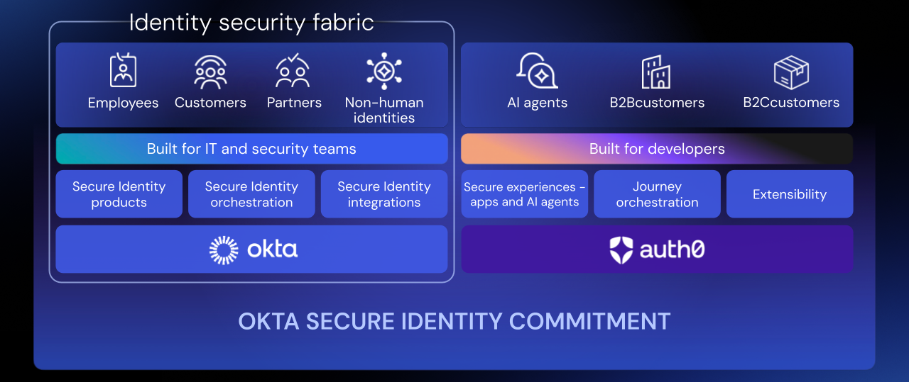

## La situazione nel 2024

Il recente report **"Framework segnaletico di Vigilanza degli incidenti operativi o di sicurezza - Analisi orizzontale 2024"**[^1] della Banca d'Italia non è solo una statistica, è un campanello d'allarme strategico per l'intero settore finanziario italiano (e, per estensione, europeo). I dati sono netti e preoccupanti: un **aumento del 45% degli incidenti operativi e di sicurezza segnalati**, per un totale di **188 notifiche**, il livello più alto mai registrato dal 2020.

Evoluzione degli Incidenti Bancari in Italia (2020-2024): +45% nel 2024

Ma il dato più rivelatore emerge dall'analisi dettagliata: il **65% di tutti gli incidenti ha coinvolto un fornitore di servizi esterno**, un balzo enorme rispetto al 45% del 2023. Questo, unito a un tempo medio di ripristino dei servizi più che raddoppiato (da 9 a 21 ore), ci dice una cosa chiara: il perimetro di sicurezza tradizionale non esiste più. Il rischio è frammentato, interconnesso e risiede sempre più nella gestione delle identità e degli accessi privilegiati.

Il panorama delle minacce si sta inoltre evolvendo rapidamente. Gli attacchi DDoS "rumorosi" sono crollati del 75% (da 16 nel 2023 a 4 nel 2024), lasciando spazio a minacce più silenziose e mirate come **malware (50% degli incidenti cyber), accessi non autorizzati (45%) e social engineering (22,5%)**. L'obiettivo non è più solo "buttare giù" un servizio, ma *infiltrarsi, rubare credenziali e muoversi lateralmente* attraverso l'infrastruttura digitale interconnessa.[^1]

Questi dati italiani riflettono un trend europeo più ampio. L'European Banking Authority (EBA) riporta che oltre il 58% delle banche europee ha subito almeno un cyberattacco nel secondo semestre 2024, con il 24% che ha registrato almeno un attacco riuscito con impatto significativo[^2]. Parallelamente, l'ENISA ha identificato 488 incidenti cyber pubblicamente riportati nel settore finanziario europeo tra gennaio 2023 e giugno 2024, con le banche come obiettivo primario nel 46% dei casi[^3].

In questo scenario, normative come il **Digital Operational Resilience Act (DORA)** e la **Network and Information Security (NIS) 2** non sono un mero onere burocratico, ma la risposta logica e necessaria a questa nuova realtà. Con le scadenze normative di DORA e NIS2 già in vigore dal gennaio 2025, l'urgenza di adottare un nuovo modello di difesa è massima[^4][^5].

La domanda non è più *se* adottare una strategia di sicurezza basata sull'identità, ma *come* costruirla in modo che sia coesa, scalabile e resiliente di fronte a minacce sempre più sofisticate.

## La risposta strategica: costruire un "Identity Fabric" resiliente

Affrontare minacce così diverse — fragilità interna, attacchi esterni mirati e vulnerabilità della supply chain — con un mosaico di soluzioni di sicurezza isolate è una strategia perdente. Ogni strumento crea un nuovo silo, aumentando la complessità operativa e lasciando pericolose zone d'ombra che gli attaccanti possono sfruttare.

La risposta moderna è un approccio di **piattaforma unificata**: l'**[Identity Fabric](https://www.okta.com/identity-101/identity-fabric-the-future-of-identity-and-access-management/)** di Okta.

**Cos'è un Identity Fabric?** L'Identity Fabric è un'architettura di sicurezza dell'identità unificata che supporta tutti i casi d'uso dell'identità essendo completamente orchestrata e integrata. Immaginatelo come un tessuto connettivo intelligente che unifica la sicurezza di **tutte le identità** (dipendenti, clienti, partner, API, agenti AI e service account) e di **tutte le risorse** (applicazioni, infrastrutture, dati). Invece di silos frammentati, crea un unico piano di controllo che offre visibilità centralizzata, orchestrazione delle policy e risposta coordinata alle minacce.

La **[Okta Platform](https://www.okta.com/products/okta-platform/)** rappresenta l'evoluzione naturale di questa visione, offrendo una soluzione end-to-end che porta l'Identity Fabric alla vita reale. Composto da **[Okta Workforce Identity](https://www.okta.com/products/workforce-identity/)** e **[Okta Customer Identity](https://www.okta.com/products/okta-customer-identity/)**, la piattaforma è progettata con questa architettura in mente, garantendo che l'ecosistema di prodotti lavori insieme per ridurre il rischio mentre le organizzazioni si concentrano sul fornire esperienze digitali di primo livello (cfr. *[One Platform, Every Identity](https://www.okta.com/blog/2025/05/one-platform-every-identity-unifying-okta-customer-identity-with-okta-workforce/)*).

Un concetto fondamentale di questo approccio è la **neutralità tecnologica**, che garantisce la libertà di scegliere le migliori tecnologie senza essere vincolati a un unico ecosistema proprietario. Questo è particolarmente critico in un settore come quello bancario, dove l'integrazione con sistemi legacy e fornitori terzi è essenziale.

Un Identity Fabric efficace si fonda su quattro pilastri strategici che lavorano in sinergia.

### 1. Oltre l'MFA: autenticazione a prova di phishing

Con il social engineering e il furto di credenziali come vettori d'attacco primari (responsabili del 22,5% degli incidenti cyber nel 2024), l'MFA tradizionale (notifiche push, OTP) non è più sufficiente. È essenziale neutralizzare il phishing alla radice con metodi phishing-resistant.[^1]

**Le tecnologie chiave:**

- **[Okta FastPass](https://www.okta.com/products/fastpass/)** utilizza standard crittografici aperti come FIDO2 per legare l'autenticazione crittograficamente al dispositivo. In parole semplici, anche se un utente viene ingannato e inserisce le proprie credenziali su un sito falso, queste sono inutili per l'attaccante perché non possono essere riutilizzate altrove grazie alla crittografia a chiave pubblica.
- **[Okta Adaptive MFA](https://www.okta.com/products/adaptive-multi-factor-authentication/)**: Questa soluzione va oltre l'MFA statico, offrendo **autenticazione dinamica basata sul rischio** che valuta il contesto di ogni tentativo di accesso. Il sistema analizza fattori come ubicazione geografica, dispositivo utilizzato, comportamento dell'utente e indicatori di compromissione (come l'uso di proxy o password compromesse) per determinare automaticamente il livello di autenticazione richiesto. Per transazioni ad alto rischio o accessi da dispositivi non conformi, può richiedere fattori aggiuntivi come WebAuthn o biometria, mentre per scenari a basso rischio riduce l'attrito per l'utente mantenendo la sicurezza.

### 2. Governance Totale: gestire il ciclo di vita di *tutte* le identità

Il dato del 65% degli incidenti che coinvolge fornitori evidenzia un problema critico di governance degli accessi nella supply chain digitale. Questo rischio è amplificato dall'esplosione delle **Identità Non Umane (NHI)** — API key, service account, token di sistema, certificati digitali — che oggi superano numericamente di gran lunga quelle umane e sono il tessuto connettivo della supply chain digitale. La mancata governance di queste identità con lo stesso rigore di quelle umane rappresenta una violazione diretta dei principi DORA.[^1]

**Le tecnologie chiave:**

- **[Okta Identity Governance (OIG)](https://www.okta.com/products/identity-governance/)** automatizza l'intero ciclo di vita dell'accesso attraverso flussi **JML (Joiner-Mover-Leaver)** intelligenti. Il sistema garantisce che a ogni identità — umana e non — venga applicato rigorosamente il principio del **least privilege** attraverso flussi di richiesta e approvazione tracciabili, campagne di certificazione periodiche automatizzate e de-provisioning automatico quando le identità non sono più necessarie. Per le identità non umane, implementa rotazione automatica delle credenziali e monitoraggio continuo dell'utilizzo.
- **[Okta Privileged Access](https://www.okta.com/products/privileged-access/)**: Questa soluzione PAM nativa cloud elimina l'accesso permanente (standing access) a server, container e applicazioni SaaS privilegiate. Implementa il principio **Zero Standing Privileges**, richiedendo approvazioni just-in-time per l'accesso a risorse critiche. Include un **vault cloud** per la gestione sicura di credenziali condivise, registrazione completa delle sessioni SSH/RDP per compliance, e integrazione nativa con **Okta Access Requests** per flussi di approvazione multi-step con giustificazione aziendale e durate temporali limitate. Particolarmente importante per le banche, gestisce anche l'accesso privilegiato alle **identità di break-glass** e ai service account critici.

### 3. Dalla prevenzione alla protezione continua e proattiva

La sicurezza non può essere un controllo statico al momento del login. Deve essere un processo dinamico che valuta il rischio in tempo reale, per tutta la durata della sessione, adattandosi continuamente al panorama delle minacce in evoluzione.

**Le tecnologie chiave:** Qui servono due capacità complementari che lavorano in sinergia per offrire protezione a 360 gradi:

- **[Okta ISPM – Identity Security Posture Management](https://www.okta.com/products/identity-security-posture-management/)**: È la difesa **proattiva**. ISPM funziona come un "check-up" continuo della tua infrastruttura di identità, scansionando costantemente i sistemi cloud (Azure AD, AWS, Google Workspace, Salesforce) per identificare e correggere configurazioni errate, lacune nell'MFA, privilegi eccessivi e vulnerabilità di sicurezza *prima* che vengano sfruttate dagli attaccanti. Con l'introduzione delle nuove capacità 2025, ISPM ora protegge anche **agenti AI e identità non umane**, scoprendo automaticamente service account, API key e altre identità automatizzate che spesso sfuggono alla governance tradizionale.
- **[Okta ITP – Identity Threat Protection](https://www.okta.com/products/identity-threat-protection/)**: È la difesa **reattiva** in tempo reale. Utilizzando standard aperti come **CAEP (Continuous Access Evaluation Protocol)** e **SSF (Shared Signals Framework)** per integrare segnali di rischio dall'intero ecosistema di sicurezza (ad esempio da un EDR come CrowdStrike), ITP monitora attivamente ogni sessione *dopo* il login iniziale. Se rileva un'anomalia — come un cambio di IP sospetto, un alert da un sistema di sicurezza del dispositivo, o un comportamento utente insolito — può intervenire automaticamente terminando la sessione, richiedendo una riautenticazione, o escalando l'incident al team di sicurezza.

### 4. Non dimenticare il Cliente: CIAM per ambienti altamente regolamentati

La fiducia del cliente rappresenta l'asset più prezioso per ogni istituzione finanziaria. Proteggere gli account dei clienti da frodi e account takeover richiede lo stesso livello di rigore applicato internamente, ma con un'attenzione particolare all'equilibrio tra sicurezza e user experience. Nel settore bancario, dove ogni attrito può tradursi in abbandono del cliente, questo equilibrio è particolarmente delicato.

**La tecnologia chiave:** **[Okta Customer Identity](https://www.okta.com/products/okta-customer-identity/)** con **[Highly Regulated Identity (HRI)](https://www.okta.com/products/regulated-identity/)** rappresenta la soluzione **Financial-Grade Identity™** per operazioni customer sensibili. HRI è progettata specificamente per soddisfare i più alti standard di sicurezza e conformità normativa nel settore finanziario.

**HRI implementa tre pilastri di sicurezza fondamentali:**

**Strong Customer Authentication (SCA) con Dynamic Linking**: HRI implementa l'SCA come definito dalla PSD2, richiedendo almeno due fattori di autenticazione indipendenti (qualcosa che conosci, possiedi, sei). Il **Dynamic Linking** lega crittograficamente i dettagli della transazione al processo di approvazione SCA, mostrando all'utente esattamente cosa sta approvando (es. "Autorizzare pagamento di €1.000 a Giovanni Rossi?") e prevenendo così i sophisticated fraud tramite transaction tampering[^6].

**Protocolli FAPI 1 Advanced**: HRI è una implementazione certificata dello standard **Financial-Grade API** dell'OpenID Foundation, che include[^7]:

- **PAR (Pushed Authorization Requests)**: Sposta i parametri sensibili della transazione dal front-channel (browser) a chiamate back-end autenticate, impedendo l'intercettazione
- **JAR (JWT-Secured Authorization Request)**: Protegge l'integrità della richiesta di autorizzazione tramite firma digitale  
- **JWE (JSON Web Encryption)**: Cripta il payload degli access token per prevenire data breach applicativi

**Autenticazione applicativa rafforzata**: Supporta **Private Key JWT** e **mTLS (Mutual TLS)** come alternative ai client secret, eliminando la trasmissione di segreti sulla rete. Il **Token Binding** garantisce che solo l'applicazione che ha richiesto un access token possa utilizzarlo, rendendo i token inutili anche se intercettati.

**Personalizzazione e User Experience**: Nonostante i rigorosi controlli di sicurezza, HRI mantiene un'esperienza utente fluida attraverso l'integrazione nativa con **Okta Actions** per logiche di autorizzazione personalizzate e nuovi template per **New Universal Login** che permettono di customizzare le schermate di approvazione basandosi sul tipo e sui dettagli della transazione specifica (vedi *[Okta Blog](https://www.okta.com/blog/2024/07/highly-regulated-identity-the-key-to-easier-more-secure-customer-interactions/)*).

## Da obbligo normativo a vantaggio strategico

I dati del report della Banca d'Italia, supportati dai trend europei documentati da EBA ed ENISA, delineano chiaramente un campo di battaglia cyber sempre più complesso e interconnesso. Con l'80% degli incidenti che colpisce i servizi di pagamento e il 65% che coinvolge fornitori terzi, affrontare queste sfide con un approccio frammentato non è più sostenibile né economicamente efficiente.[^1][^2][^3]

L'implementazione dell'**EU Systemic Cyber Incident Coordination Framework (EU-SCICF)** sotto DORA evidenzia come anche i regolatori riconoscano che la resilienza cyber richieda coordinamento e visibilità unificata a livello sistemico. Questo stesso principio si applica a livello aziendale: serve un **Identity Fabric** unificato[^8].

Costruire un **Identity Fabric** con la **Okta Platform** significa passare da una postura di difesa reattiva frammentata a una di resilienza proattiva orchestrata. Significa unificare la visibilità su tutte le identità (umane e non), automatizzare la governance degli accessi e orchestrare la risposta alle minacce su una piattaforma coerente e scalabile.

Questo approccio non solo permette di rispondere efficacemente ai requisiti stringenti di DORA e NIS2, ma trasforma la sicurezza da un centro di costo operativo a un vero e proprio **abilitatore strategico di business**. Una piattaforma di identità unificata e resiliente non solo protegge l'organizzazione da minacce sempre più sofisticate, ma rafforza simultaneamente la fiducia di clienti e partner, accelera l'onboarding di nuovi servizi digitali e riduce i costi operativi attraverso l'automazione intelligente.

Nel panorama attuale, dove il tempo medio di ripristino è più che raddoppiato e dove le minacce diventano sempre più silenziose e persistenti, l'Identity Fabric non è più un'opzione futuribile — è una necessità strategica immediata per la sopravvivenza digitale del settore finanziario.

*La tua organizzazione sta ancora gestendo le identità in silos frammentati o sta già costruendo un approccio di piattaforma unificato? Quali sono le maggiori sfide che vedete all'orizzonte nella gestione degli accessi (privilegiati e non) e delle identità non umane?*

[^1]: [Framework segnaletico di Vigilanza degli incidenti operativi o di sicurezza - Analisi orizzontale 2024](https://www.bancaditalia.it/compiti/vigilanza/analisi-sistema/approfondimenti-banche-int/Framework-segnaletico-di-Vigilanza-degli-incidenti-operativi-o-di-sicurezza-Analisi-orizzontale-2024.pdf), Banca d'Italia, Luglio 2025

[^2]: [EBA Risk Assessment Report - Autumn 2024](https://www.eba.europa.eu/publications-and-media/press-releases/eu-banks-continue-be-robust-although-risks-geopolitical-tensions-and-cyber-threats-remain), European Banking Authority, Novembre 2024

[^3]: [ENISA Threat Landscape: Finance Sector](https://www.enisa.europa.eu/publications/enisa-threat-landscape-finance-sector), European Union Agency for Cybersecurity, Febbraio 2025

[^4]: [Digital Operational Resilience Act (DORA)](https://www.digital-operational-resilience-act.com/), Regolamento UE 2022/2554, applicabile dal 17 gennaio 2025

[^5]: [Network and Information Security (NIS) 2 Directive](https://www.nis-2-directive.com/), Direttiva UE 2022/2555

[^6]: [Guide to PSD2, Strong Customer Authentication & 3D Secure](https://www.ravelin.com/insights/ultimate-guide-psd2-strong-customer-authentication), Ravelin, 2024

[^7]: [Financial-Grade API Security Profile](https://curity.io/resources/learn/what-is-financial-grade/), Curity, 2023

[^8]: [EU Systemic Cyber Incident Coordination Framework](https://www.eu-scicf.com/), ESRB Recommendation, implementato con DORA 2025