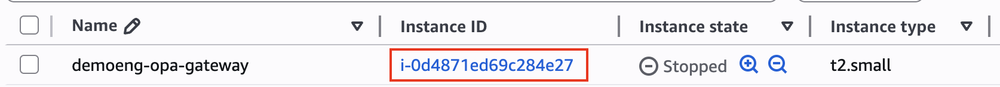

## Introduction

The following is a collections of scripts and Workflows for automating the startup/shutdown of EC2 VMs in AWS.

I use it in my demo environment, but it's a good example of integration between AWS and Okta Workflows.

I’m using a mix of **Lambda** scripts, **CloudWatch** Automation, **Route53** DNS Zone, and Okta **Workflows** , and at the end I have:

- Startup/shutdown button in my Okta dashboard
  
- Auto-shutdown of the VMs every evening (in case I forgot it)
- Auto-update the Public DNS so that I don’t care about the dynamic Public IP address

### High-level diagram


Let's see in detail how to put this in place.

---

## AWS IAM Role

The first step is creating an IAM role to run the automation. For practicality, I made a single role for both EC2 and Route53 management, but you can split them if you prefer.

1. Open the [AWS IAM Console](https://us-east-1.console.aws.amazon.com/iam/home "https://us-east-1.console.aws.amazon.com/iam/home")
2. Create a new Policy (*Policies → Create policy* )
3. On the policy editor, click on JSON
4. Copy the following code:

   ```json
   {
       "Version": "2012-10-17",
       "Statement": [
           {
               "Effect": "Allow",
               "Action": [
                   "logs:CreateLogGroup",
                   "logs:CreateLogStream",
                   "logs:PutLogEvents"
               ],
               "Resource": "*"
           },
           {
               "Effect": "Allow",
               "Action": [
                   "route53:ChangeResourceRecordSets",
                   "route53:ListHostedZones",
                   "route53:ListResourceRecordSets"
               ],
               "Resource": "*"
           },
           {
               "Effect": "Allow",
               "Action": [
                   "ec2:DescribeInstances",
                   "ec2:StartInstances",
                   "ec2:StopInstances"
               ],
               "Resource": "*"
           }
       ]
   }
   ```
5. Save the policy, giving a name like “*LambdaAutomationsPolicy* ”
6. Create a new IAM Role of “*Custom trust policy* ” type
7. Select “*Lambda* ” as Service or use case
8. In the Add permissions step, select the previously created policy
9. Give it a name (i.e., “*LambdaAutomationRole* ”) and save


`"Resource": "*"` gives access to all the EC2 or Route53 resources. This is fine in a demo/dev environment. For use in production, it’s warmly recommended to use a least privilege approach: create different roles for EC2 and Route53, and limit the scope only to the resources that need to be accessed by the Lambda script.


## AWS Lambda functions

### Power On/Off

1. Create a new Lambda function
2. Name: “*PowerCycle* ”
3. Runtime: “*Python 3* ”
4. Click on “*Change default execution role* ” and then “*Use an existing role* ”
5. Search for the role previously created (*LambdaAutomationRole* )
6. Leave all the other options as default
7. Click on “*Create function* ”
8. In the Code source section, copy the following script:

   ```python
   import json
   import logging
   import boto3
   import re # Import the regular expression module
   from botocore.exceptions import ClientError

   # Initialize logger for better logging to CloudWatch
   logger = logging.getLogger()
   logger.setLevel(logging.INFO) # Set to logging.DEBUG for more detailed logs


   def lambda_handler(event, context):
       # Log the entire incoming event for debugging
       logger.info(f"Received event: {json.dumps(event)}")

       # --- Input Validation for Region ---
       if 'region' not in event or not isinstance(event['region'], str) or not event['region'].strip():
           logger.error("Validation Error: Missing or invalid 'region' in event.")
           return {
               "statusCode": 400,
               "body": json.dumps({"message": "Missing or invalid 'region' in event."})
           }
       region = event['region'].strip()

       # --- Input Validation for Operation ---
       if 'operation' not in event or event['operation'] not in ['start', 'stop']:
           logger.error("Validation Error: Missing or invalid 'operation' in event. Must be 'start' or 'stop'.")
           return {
               "statusCode": 400,
               "body": json.dumps({"message": "Missing or invalid 'operation' in event. Must be 'start' or 'stop'."})
           }
       operation = event['operation']

       # --- Input Validation and Processing for Instances ---
       if 'instances' not in event or not isinstance(event['instances'], str) or not event['instances'].strip():
           logger.error("Validation Error: Missing or invalid 'instances' in event. Must be 'all' or a comma-separated list of EC2 instance IDs.")
           return {
               "statusCode": 400,
               "body": json.dumps({"message": "Missing or invalid 'instances' in event. Must be 'all' or a comma-separated list of EC2 instance IDs."})
           }

       instances_input = event['instances'].strip()
       instances_to_process = []
       failed_initial_validation_instances = [] # To capture instances that failed format validation or 'all' logic

       # Initialize Boto3 EC2 client outside the instance loop but after region validation
       try:
           ec2 = boto3.client('ec2', region_name=region)
       except Exception as e:
           logger.error(f"Failed to initialize EC2 client for region {region}: {e}", exc_info=True)
           return {
               "statusCode": 500,
               "body": json.dumps({"message": f"Failed to initialize EC2 client for region {region}."})
           }

       # Handle "all" instances logic
       if instances_input.lower() == 'all':
           logger.info(f"Operation '{operation}' requested for ALL EC2 instances in region '{region}'.")
           try:
               # Describe all instances to filter based on current state
               describe_paginator = ec2.get_paginator('describe_instances')
               all_reservations = describe_paginator.paginate()

               for page in all_reservations:
                   for reservation in page.get('Reservations', []):
                       for instance in reservation.get('Instances', []):
                           instance_id = instance['InstanceId']
                           instance_state = instance['State']['Name']

                           if operation == 'start' and instance_state in ['stopped', 'stopping']:
                               instances_to_process.append(instance_id)
                           elif operation == 'stop' and instance_state in ['running', 'pending']:
                               instances_to_process.append(instance_id)
                           else:
                               # Log instances that are not in a suitable state for the operation
                               logger.info(f"Skipping instance {instance_id} for '{operation}' operation due to current state: '{instance_state}'.")

               if not instances_to_process:
                   logger.warning(f"No instances found in a suitable state ('stopped' for start, 'running' for stop) for '{operation}' operation in region '{region}'.")
                   # Return 200 OK, as the operation completed successfully by finding no targets.
                   return {
                       "statusCode": 200,
                       "body": json.dumps({
                           "message": f"No instances found in suitable state for '{operation}' operation in region '{region}'.",
                           "operation": operation,
                           "successful_instances": [],
                           "failed_instances": []
                       })
                   }

           except ClientError as e:
               error_code = e.response.get("Error", {}).get("Code")
               error_message = e.response.get("Error", {}).get("Message")
               logger.error(f"AWS API Error describing all instances in {region}: [{error_code}] {error_message}", exc_info=True)
               return {
                   "statusCode": 500,
                   "body": json.dumps({"message": f"Failed to list all instances in {region}: {error_message}"})
               }
           except Exception as e:
               logger.critical(f"Unexpected error describing all instances in {region}: {e}", exc_info=True)
               return {
                   "statusCode": 500,
                   "body": json.dumps({"message": f"Unexpected error listing all instances in {region}: {str(e)}"})
               }

       else:
           # Process comma-separated list with instance ID format validation
           instance_ids_raw = instances_input.split(',')
           # Regex for standard EC2 instance ID format: 'i-' followed by 17 lowercase hexadecimal characters
           instance_id_regex = re.compile(r"^i-[0-9a-f]{17}$") 

           for instance_id_str in instance_ids_raw:
               cleaned_id = instance_id_str.strip()
               if not cleaned_id:
                   continue # Skip empty strings

               if instance_id_regex.match(cleaned_id):
                   instances_to_process.append(cleaned_id)
               else:
                   # Add to failed list right away if format is invalid
                   failed_initial_validation_instances.append({
                       "instance_id": cleaned_id,
                       "reason": "Invalid EC2 instance ID format (must be i-xxxxxxxxxxxxxxxxx)"
                   })
                   logger.warning(f"Skipping instance ID '{cleaned_id}' due to invalid format. Must match 'i- followed by 17 hex characters'.")

       # If no valid instances were provided (either empty list or all invalid format)
       if not instances_to_process and not failed_initial_validation_instances:
           logger.error("Validation Error: No valid EC2 instance IDs provided for processing.")
           return {
               "statusCode": 400,
               "body": json.dumps({"message": "No valid EC2 instance IDs provided for processing."})
           }
       elif not instances_to_process and failed_initial_validation_instances:
           # If instances_to_process is empty but failed_initial_validation_instances is not,
           # it means all provided IDs were invalid format.
           logger.error(f"Validation Error: All provided EC2 instance IDs had an invalid format: {failed_initial_validation_instances}")
           return {
               "statusCode": 400,
               "body": json.dumps({
                   "message": "All provided EC2 instance IDs had an invalid format.",
                   "invalid_instances": failed_initial_validation_instances # Include details of invalid instances
               })
           }

       # --- End Input Validation and Processing for Instances ---

       logger.info(f"Attempting to {operation} the following instances: {instances_to_process} in region: {region}")

       # Initialize lists to store results of the EC2 operations
       successful_operations = []
       failed_operations = []

       # Pre-populate failed_operations with instances that failed initial format validation
       # This ensures they are part of the final error report.
       failed_operations.extend(failed_initial_validation_instances)

       for instance_id in instances_to_process:
           try:
               if operation == 'start':
                   ec2.start_instances(InstanceIds=[instance_id])
                   logger.info(f"Successfully initiated 'start' for instance: {instance_id}")
               elif operation == 'stop':
                   ec2.stop_instances(InstanceIds=[instance_id])
                   logger.info(f"Successfully initiated 'stop' for instance: {instance_id}")

               # Append to successful_operations only after the API call succeeds
               successful_operations.append(instance_id)

           except ClientError as e:
               # Granular Exception Handling for AWS API errors during start/stop
               error_code = e.response.get("Error", {}).get("Code")
               error_message = e.response.get("Error", {}).get("Message")
               logger.error(f"AWS API Error during '{operation}' of instance {instance_id}: [{error_code}] {error_message}", exc_info=True)
               failed_operations.append({
                   "instance_id": instance_id,
                   "reason": f"AWS API Error: [{error_code}] {error_message}"
               })
           except Exception as e:
               # Catch any other unexpected Python exceptions
               logger.error(f"Unexpected error during '{operation}' of instance {instance_id}: {e}", exc_info=True)
               failed_operations.append({
                   "instance_id": instance_id,
                   "reason": f"Unexpected error: {str(e)}"
               })

       # Determine overall status and structure response
       overall_message = ""
       status_code = 200 # Default to success unless all failed

       if not successful_operations and failed_operations:
           # All attempted operations (including initial format failures) failed
           status_code = 500 # Indicates a problem with the overall execution or input
           overall_message = f"Failed to {operation} any of the specified instances. Check 'failed_instances' for details."
       elif successful_operations and failed_operations:
           # Partial success (some worked, some failed)
           status_code = 200 # Still considered a success for the Lambda invocation, but with warnings
           overall_message = f"Successfully initiated {operation} for some instances, others failed. Check results for details."
       else:
           # All successful (including cases where 'all' was specified but no suitable instances were found)
           overall_message = f"Successfully initiated {operation} for all specified instances."

       # Final response body
       response_body = {
           "message": overall_message,
           "operation": operation,
           "successful_instances": successful_operations,
           "failed_instances": failed_operations,
           "region": region
       }

       logger.info(f"Function execution completed. Status: {status_code}, Message: {overall_message}")
       return {
           "statusCode": status_code,
           "body": json.dumps(response_body) # Body must be a JSON string
       }
   ```
9. In the “*Configuration*” tab, click on “*Edit*” on the General Configuration and change the timeout to 30 seconds
10. Let’s test our code, click on the tab “*Test*”
    a. Create a new event
    b. Insert a name like “*Test Start VM*”
    c. In the JSON area, insert this code (remember to change the region and instances based on your environment):

    ```json {
    "region":"us-east-1",
    "operation":"start",
    "instances": "i-08762c631736abca9"
    }
    ```
11. Click on “*Deploy*” on the left in order to publish and enable the code
12. Click on “*Save*”

#### How it works

The script receives as input a JSON with some data:

```json
{
  "region":"us-east-1",
  "operation":"start",
  "instances": "i-08762c631736abca9,i-05882f74566ffab18"
}
```

The parameters are:


|||
| - | - |
| **region**    | AWS EC2 region                                                      |
| **operation** | *start* or *stop*                                                   |
| **instances** | comma-separated list of the instances on which to do the operation. |


You can find the instance IDs in the [AWS EC2 console](https://us-east-1.console.aws.amazon.com/ec2/home?region=us-east-1#Instances:v=3).



<br/>


If the instance value is “*all*” it will execute the operation on all the EC2 VMs of the selected region. Example:

```json
{
  "region":"us-east-1",
  "operation":"start",
  "instances": "all"
}
```



### DNS Update


You can skip this part if you want to implement only the start/stop automation without the DNS auto-update.


1. Create a new Lambda function
2. Name: “*UpdateDNS* ”
3. Runtime: “*Python 3* ”
4. Click on “*Change default execution role* ” and then “*Use an existing role* ”
5. Search for the role previously created (*LambdaAutomationRole* )
6. Leave all the other options as default
7. Click on “*Create function* ”
8. In the Code source section, copy the following script and change the `HOSTED_ZONE_ID` variable with your Route53 zone ID:

   ```python
   import json
   import boto3
   import logging
   from botocore.exceptions import ClientError

   # Initialize logger
   logger = logging.getLogger()
   logger.setLevel(logging.INFO) # Set to logging.DEBUG for more verbose logs

   # --- GLOBAL STATIC CONFIGURATION VARIABLES ---
   HOSTED_ZONE_ID = "Z00000000X0XXXXXXXXX" # Your Route 53 Hosted Zone ID
   DNS_RECORD_TTL = 30                     # Time-to-Live for the DNS record (in seconds)
   # --- END GLOBAL STATIC CONFIGURATION VARIABLES ---


   def lambda_handler(event, context):
       logger.info(f"Received event: {json.dumps(event)}")

       # Extract instance-id and region from the EC2 State-change event
       detail = event.get('detail', {})
       instance_id = detail.get('instance-id')
       region = event.get('region')

       # --- Input Validation for Event ---
       if not instance_id or not region:
           error_body = {
               "status": "error",
               "message": "Missing 'instance-id' or 'region' in the EC2 state-change event detail.",
               "event": event
           }
           logger.error(f"Validation Error: {error_body['message']} Event: {json.dumps(event)}")
           return {
               "statusCode": 400,
               "body": json.dumps(error_body, default=str)
           }

       logger.info(f"Processing EC2 instance '{instance_id}' in region '{region}' for DNS update.")

       try:
           # Initialize Boto3 clients
           ec2 = boto3.client('ec2', region_name=region)

           update_results = []

           # Describe the instance to get the public IP and tags
           try:
               described_instances_response = ec2.describe_instances(InstanceIds=[instance_id])
               reservations = described_instances_response.get('Reservations', [])
           except ClientError as e:
               error_code = e.response.get("Error", {}).get("Code")
               error_message = e.response.get("Error", {}).get("Message")
               logger.error(f"AWS API Error describing instance {instance_id}: [{error_code}] {error_message}", exc_info=True)
               return {
                   "statusCode": 404,
                   "body": json.dumps({"status": "error", "message": f"Failed to describe instance {instance_id}: {error_message}"}, default=str)
               }
           except Exception as e:
               logger.critical(f"Unexpected error describing instance {instance_id}: {e}", exc_info=True)
               return {
                   "statusCode": 500,
                   "body": json.dumps({"status": "error", "message": f"Unexpected error describing instance {instance_id}: {str(e)}"}, default=str)
               }

           found_instance_details = False
           for reservation in reservations:
               for instance in reservation.get('Instances', []):
                   found_instance_details = True

                   # Get the PublicDNS tag value
                   dns_name = None
                   ec2_name = None

                   if 'Tags' in instance:
                       for tag in instance['Tags']:
                           if tag['Key'] == 'PublicDNS':
                               dns_name = tag['Value']
                           if tag['Key'] == 'Name':
                               ec2_name = tag['Value']

                   if not dns_name: # This condition handles both 'tag not present' and 'tag is empty string'
                       if ec2_name: # Check if the Name tag was found and has a value
                               dns_name = ec2_name
                               logger.info(f"'PublicDNS' tag was missing or empty for instance '{instance['InstanceId']}'. Falling back to 'Name' tag: '{ec2_name}'.")
                       else: # Log specific warnings if neither tag provided a usable name
                           logger.warning(f"Neither 'PublicDNS' nor 'Name' tags found for instance '{instance['InstanceId']}'.")
                           return {
                               "statusCode": 400,
                               "body": json.dumps({
                                   "status": "error",
                                   "message": f"Cannot determine DNS name for instance '{instance['InstanceId']}': No tags found on the instance."
                               })
                           }

                   # Get the public IP address
                   ip_address = instance.get('PublicIpAddress', None)

                   if dns_name and ip_address:
                       logger.info(f"Found instance '{instance['InstanceId']}', DNS name: '{dns_name}', Public IP: '{ip_address}'. Attempting DNS update.")
                       # Perform the DNS update
                       update_result = do_dns_update(HOSTED_ZONE_ID, dns_name, ip_address, DNS_RECORD_TTL)
                       update_results.append(update_result)
                   else:
                       # Domain name (from tag or fallback) or public IP is missing
                       reason_msg = ""
                       if not dns_name:
                           reason_msg += f"Missing or empty 'PublicDNS' and no usable 'Name' tag."
                       if not ip_address:
                           if reason_msg: reason_msg += " And "
                           reason_msg += "missing 'PublicIpAddress'."

                       msg = f"Skipping instance '{instance['InstanceId']}': {reason_msg}"
                       logger.warning(msg)
                       update_results.append({
                           "instance_id": instance['InstanceId'],
                           "action": "skipped",
                           "reason": msg,
                           "status": "skipped"
                       })

           if not found_instance_details:
               error_body = {
                   "status": "error",
                   "message": f"Instance with ID '{instance_id}' not found or could not be described.",
                   "instance_id": instance_id,
                   "region": region
               }
               logger.error(f"Execution Error: {error_body['message']}")
               return {
                   "statusCode": 404,
                   "body": json.dumps(error_body, default=str)
               }

           # Determine overall status for the response
           overall_status_message = "DNS update process completed successfully."
           final_status_code = 200

           if any(result.get('status') == 'error' for result in update_results):
               overall_status_message = "Some DNS updates failed. Check 'updates' for details."

           if not update_results:
                overall_status_message = f"No DNS updates were attempted for instance {instance_id}."
                final_status_code = 200

           response_body = {
               "status": "success" if not any(result.get('status') == 'error' for result in update_results) else "partial_success_with_errors",
               "message": overall_status_message,
               "instance_id": instance_id,
               "region": region,
               "updates": update_results
           }

           logger.info(f"Function execution completed with status: {response_body['status']}")
           return {
               "statusCode": final_status_code,
               "body":  json.dumps(response_body, default=str)
           }

       except Exception as e:
           error_body = {
               "status": "error",
               "message": f"An unexpected error occurred during execution: {str(e)}",
               "instance_id": instance_id,
               "region": region,
               "event": event
           }
           logger.critical(f"Unhandled critical exception in lambda_handler: {str(e)}", exc_info=True)
           return {
               "statusCode": 500,
               "body": json.dumps(error_body, default=str)
           }


   ### Helper Functions ###

   def do_dns_update(hosted_zone_id, dns_name, ip_address, ttl):
       # Upserts (creates or updates) a DNS record in Route 53 for the given domain name.

       logger.info(f"Attempting UPSERT for DNS record: {dns_name} (Type: A, TTL: {ttl}) to IP: {ip_address} in Hosted Zone: {hosted_zone_id}")
       try:
           route53 = boto3.client('route53')
           response = route53.change_resource_record_sets(
               HostedZoneId=hosted_zone_id,
               ChangeBatch={
                   'Comment': 'Updated by Lambda upon EC2 state change',
                   'Changes': [
                       {
                           'Action': 'UPSERT',
                           'ResourceRecordSet': {
                               'Name': dns_name,
                               'Type': 'A',
                               'TTL': ttl,
                               'ResourceRecords': [{'Value': ip_address}]
                           }
                       }
                   ]
               }
           )
           change_info = response.get("ChangeInfo", {})
           logger.info(f"Successfully UPSERTed DNS record for {dns_name} -> {ip_address}. Change ID: {change_info.get('Id')}")
           logger.debug(f"Route53 Change Info: {json.dumps(change_info, default=str)}")

           return {
               "dns_name": dns_name,
               "ip_address": ip_address,
               "action": "UPSERT",
               "change_info": change_info,
               "status": "success"
           }

       except ClientError as e:
           error_code = e.response.get("Error", {}).get("Code")
           error_message = e.response.get("Error", {}).get("Message")
           error_msg = f"AWS API Error updating DNS record for {dns_name} to {ip_address}: [{error_code}] {error_message}"
           logger.error(error_msg, exc_info=True)
           return {
               "dns_name": dns_name,
               "ip_address": ip_address,
               "action": "UPSERT",
               "status": "error",
               "error_code": error_code,
               "error_message": error_message
           }
       except Exception as e:
           error_msg = f"Unexpected error updating DNS record for {dns_name} to {ip_address}: {str(e)}"
           logger.error(error_msg, exc_info=True)
           return {
               "dns_name": dns_name,
               "ip_address": ip_address,
               "action": "UPSERT",
               "status": "error",
               "error_message": error_msg
           }
   ```
9. In the “*Configuration* ” tab, click on “*Edit* ” on the *General Configuration* and change the timeout to 30 seconds
10. Let’s test our code, click on the tab “*Test* ”

    a. Create a new event
    b. Insert a name like “*Test DNS Update* ”
    c. In the JSON area, insert this code (remember to change the region and instances based on your environment):

    ```json
    {
      "region": "us-east-1",
      "detail": {
        "instance-id": "i-0cfb9c779e263f051",
        "state": "running"
      }
    }
    ```
11. Click on “*Deploy*” on the left in order to publish and enable the code
12. Click on Save


Remember to change the *HOSTED_ZONE_ID* variable with your Route53 zone ID in the code!

You can find it in the Route53 dashboard: 



#### How it works

The script will receive an event from CloudWatch, which contains something like:

```json
{
  "version": "0",
  "id": "7d708c67-bcb4-5397-9ad8-783d6aadc17e",
  "detail-type": "EC2 Instance State-change Notification",
  "source": "aws.ec2",
  "account": "123456789012",
  "time": "2025-01-06T12:34:56Z",
  "region": "us-east-1",
  "resources": [
    "arn:aws:ec2:us-east-1:123456789012:instance/i-0abc123456789def0"
  ],
  "detail": {
    "instance-id": "i-0cfb9c779e263f051",
    "state": "running"
  }
}
```

It extracts the *instance ID* and uses it to obtain information about the EC2 VM (tags and public IP).

At this point, if the hostname has the tag ‘PublicDNS’, it will use it. If not, it will use the VM name.


Using this method permits pointing directly to a DNS record, which will update automatically, eliminating the need to obtain the dynamic public IP address every time the EC2 instance is powered on. It’s also a way to avoid using an *Elastic IP Address* , and consequently save on AWS costs.tag



Sample with *PublicDNS* tag: 

Sample with EC2 VM Name: 

Example of a successful log:

```
INIT_START Runtime Version: python:3.13.v45	Runtime Version ARN: arn:aws:lambda:us-east-1::runtime:1c3b07a0dd0601e71b0292c41581cb633e076ad4eb3b0408ebe3d708418bd1b8
START RequestId: f9781c8c-4d8e-484e-9504-abaefc5d87fc Version: $LATEST
[INFO]	2025-06-13T08:22:22.557Z	f9781c8c-4d8e-484e-9504-abaefc5d87fc	Received event: 
{
    "version": "0",
    "id": "7d708c67-bcb4-5397-9ad8-783d6aadc17e",
    "detail-type": "EC2 Instance State-change Notification",
    "source": "aws.ec2",
    "account": "123456789012",
    "time": "2025-01-06T12:34:56Z",
    "region": "us-east-1",
    "resources": [
        "arn:aws:ec2:us-east-1:123456789012:instance/i-0abc123456789def0"
    ],
    "detail": {
        "instance-id": "i-0cfb9c779e263f051",
        "state": "running"
    }
}

[INFO]	2025-06-13T08:22:22.558Z	f9781c8c-4d8e-484e-9504-abaefc5d87fc	Processing EC2 instance 'i-0cfb9c779e263f051' in region 'eu-south-1' for DNS update.
[INFO]	2025-06-13T08:22:22.751Z	f9781c8c-4d8e-484e-9504-abaefc5d87fc	Found credentials in environment variables.
[INFO]	2025-06-13T08:22:26.168Z	f9781c8c-4d8e-484e-9504-abaefc5d87fc	Found instance 'i-0cfb9c779e263f051', DNS name: 'winclient04.dyndns.fgfinancial.xyz', Public IP: '15.161.126.254'. Attempting DNS update.
[INFO]	2025-06-13T08:22:26.168Z	f9781c8c-4d8e-484e-9504-abaefc5d87fc	Attempting UPSERT for DNS record: winclient04.dyndns.fgfinancial.xyz (Type: A, TTL: 30) to IP: 15.161.126.254 in Hosted Zone: Z00000000X0XXXXXXXXX
[INFO]	2025-06-13T08:22:26.964Z	f9781c8c-4d8e-484e-9504-abaefc5d87fc	Successfully UPSERTed DNS record for winclient04.dyndns.fgfinancial.xyz -> 15.161.126.254. Change ID: /change/C07906251F9R4KH5FQN6Q
[INFO]	2025-06-13T08:22:26.966Z	f9781c8c-4d8e-484e-9504-abaefc5d87fc	Function execution completed with status: success
END RequestId: f9781c8c-4d8e-484e-9504-abaefc5d87fc
REPORT RequestId: f9781c8c-4d8e-484e-9504-abaefc5d87fc	Duration: 4451.47 ms	Billed Duration: 4452 ms	Memory Size: 128 MB	Max Memory Used: 95 MB	Init Duration: 387.96 ms
```


With this basic script, the text collected will not be validated. This means that if there isn’t a PublicDNS tag and the Name is not a valid DNS record name, the script will end with an error.


## AWS CloudWatch Automation


You can skip this part if you want to implement only the start/stop automation without the DNS auto-update.


In this step, we will define the CloudWatch automation that calls the UpdateDNS lambda every time a VM is started.

1. Open the CloudWatch dashboard, and click on Events > Rules
2. Create a new rule
3. Name: EC2StartDNSUpdate
   
4. In the “Build event pattern” section, select “Other” as a source, then copy the following JSON in the Event pattern area:

   ```json
   {
     "source": ["aws.ec2"],
     "detail-type": ["EC2 Instance State-change Notification"],
     "detail": {
       "state": ["running"]
     }
   }
   ```

   
5. In the “Select target” section, select “AWS service” as type. Then “Lambda function” as target. In the function area, select the Lambda function “UpdateDNS” that we created just before.
6. To conclude, flag the “Use execution role” and assign the role “LambdaAutomationsRole” that we created at the beginning. This grants CloudWatch permission to invoke the Lambda.
   
7. Skip the tag configuration and click on “Create rule” to conclude


Lambda scripts and CloudWatch events are based on the region. If you’re using multiple regions, you have to copy the UpdateIP script and the CloudWatch configuration in every region.


## Okta Workflows

### Allow AWS Lambda access from Okta Workflows

1. Navigate to the IAM Console in AWS and Create a new IAM User:
   a. In the IAM dashboard, select Users from the navigation pane and then click Add users.
   b. Provide a user name (e.g., `okta-workflows-user`).
   c. For the AWS credential type, select Access key - Programmatic access.
2. Set Permissions for the User:
   a. Select Attach existing policies directly.
   b. In the filter box, search for the policy you created earlier, `LambdaAutomationsPolicy`.
   c. Check the box next to the policy.
3. Add Tags (Optional): You can add tags for organizational purposes if you wish.
4. Review and Create User:
   a. Review the user details to ensure the correct policy is attached.
   b. Click *Create user* .
5. Save Your Credentials: on the final screen, you will see the Access key ID and the Secret access key.

    This is the only time the Secret Access Key will be shown. You must click *Show and copy * both the *Access Key ID* and the *Secret Access Key* to a secure location. You can also download them as a .csv file.
6. In the Workflows dashboard, click on “Connections” and then “+ New Connection”
7. Give a mnemonic name (i.e., “*AWS Lambda* ”), select the region, and copy the Access Key and Secret generated in Step 5.

   [TO DO SCREENSHOT]

### Flowpac

You can download and import the following sample flowpack: https://github.com/fabiograsso/okta-flowpack/blob/main/awsEc2Lambda.folder

Which contains 5 sample Workflow:



Remember to change the Lambda Invoke box with your Lambda connector, and to change the instance ID/region with yours:

 



### Sample Workflow 1 (API Endpoint)

The following sample can be utilized to dynamically start/stop VMs by calling a public HTTP endpoint. It can be used in a script or called from a [bookmark in the Okta dashboard](#Bookmarks "#Bookmarks").


1. The first part will take operation (start/stop), instances, and region from the query string and use them to call the URL of the API Endpoint.
   
2. Then we compose the JSON payload by taking the information received from the query string, and we invoke the Lambda script
3. The last part is just a verification of the status code of the Lambda script, and a simple HTML page to show the output in a more fancy way
   

I’m using simple security via client token. This may be fine in a demo/non-production environment. If it has to be used in production, I warmly suggest moving to OAuth-based security or using only the delegated workflows feature.


I’m using simple security via client token. This may be fine in a demo/non-production environment. If it has to be used in production, I warmly suggest moving to OAuth-based security or using only the delegated workflows feature.



It’s also possible to generate an HTTPS Endpoint directly in AWS Lambda ([**Invoking Lambda function URLs - AWS Lambda**](https://docs.aws.amazon.com/lambda/latest/dg/urls-invocation.html)). However, I prefer to use Workflows because they are tools we know better, and they permit showcasing both Workflows themselves and other possible integrations, i.e., Delegation, and eventually Access Requests.Lambda scripts and CloudWatch events are based on the region. If you’re using multiple regions, you have to copy the UpdateIP script and the CloudWatch configuration in every region


#### How to call the Workflow

In the *API endpoint settings,* you can see the Invoke URL and the Client token


You can then invoke the Workflow by opening the following URL:
`<InvokeURL>/?operation=<start|stop>&region=<region>&instances=<all|instancesList>&clientToken=<token>`

Example:
`https://mytenant.workflows.okta.com/api/flo/13c02bb9d5ff94c2caf299c579dded95/invoke?operation=stop&region=us-east-1&instances=i-0f7bc80216a7cc919,i-0638b25eb25059af5&clientToken=8739b06603a2d41a5cc4dd5fc423f28fa71516f0cca0d20d5e07766185b83292`

HTML output of the workflow (when invoked in a browser):


### Sample Workflow 2 (Scheduled Shutdown)

The second workflow is a scheduled shutdown of all the EC2 servers in a specific AWS region at 21:00 (Paris time). I use it to avoid forgetting to shut down when I end my demos (which consequently increases the AWS invoice).

The invoke process is similar to sample 1, with the operation, region, and instances as static variables. You can then customize it by changing the *Object construct* block:


### Sample Workflow 3 (Scheduled Startup)

Very similar to sample 2, in this case, I schedule a weekly startup of an EC2 instance.

In my case, I use it to start my OAG server half an hour before the scheduled shutdown. Since there are issues when OAG remains powered off for a long time, this assures me that there is a power cycle at least once per week.

### Sample Workflow 4-5 (Delegated)

The latest samples are delegated workflows that will turn on/off all the servers in a specific region. In this case, you can showcase during a demo how to delegate a Workflow to someone without giving them access to the EC2 console. For example, a customer can give the helpdesk the right to Powercycle an EC2 server directly from the Okta console.

Remember to change the region in the Object construct block.


## Okta Bookmarks

Leveraging the workflow shown in *[Sample Workflow 1 (API Endpoint)](#sample-workflow-1-api-endpoint)* , it’s easy to create some bookmarks in the Okta dashboard.

For example, in my case, I created:

1. Link to start my AD DC and domain members
   `https://mytenant.workflows.okta.com/api/flo/13c02bb9d5ff94c2caf299c579dded95/invoke?operation=start&region=us-east-1&instances=i-0f7bc80216a7cc919,i-0638b25eb25059af5,i-0999f40dd3c643fac,i-0b267b2e8b7db8317,i-0cfb9c779e263f051&clientToken=xxxxx`
2. Link to start the AD DC only
3. Link to start OAG
4. Link to shut down everything
   `https://mytenant.workflows.okta.com/api/flo/13c02bb9d5ff94c2caf299c579dded95/invoke?operation=stop&region=us-east-1&instances=all&clientToken=xxxx`

When I need to start my demo, I can just click on the dashboard icon without opening the AWS EC2 console (or running a command in the AWS CLI). This is also a nice way to show customers the possible usage of Workflows, not strictly related to Identity.


### Voice control


Since it’s a simple HTTP request, you can also use it with a voice control such as Siri, Alexa, Google, etc.


#### iOS Example (Shortcut + Siri)

For example, on my iPhone, I created some [Shortcuts](https://support.apple.com/guide/shortcuts/welcome/ios "https://support.apple.com/guide/shortcuts/welcome/ios") with the link to the start/stop Workflows. Then I use [Siri to execute the shortcut](https://support.apple.com/guide/shortcuts/run-shortcuts-with-siri-apd07c25bb38/ios "https://support.apple.com/guide/shortcuts/run-shortcuts-with-siri-apd07c25bb38/ios"):

:speaking head: *Hey Siri, execute “Start Domain Controller”! *
or
:speaking head: Hey Siri, run shortcut *“Start Domain Controller”! *

In theory, you can just say, “*Hey Siri, Start Domain Controller!* ” But I found that it doesn't work most of the time, so it's better to explicitly say “*execute”* or “*run shortcut* .”


## AWS Costs


**TL;DR** The low usage of these Lambda functions and CloudWatch events falls well within the **AWS free tier** . In a demo environment, there will therefore be no cost to use them.


**AWS Lambda pricing ** is based on two main components: the number of requests for your functions and the duration of their execution.

- *Requests* : You are charged for the total number of requests made to your functions.
- *Duration* : This is calculated from the time your code begins executing until it terminates, rounded up to the nearest millisecond. The price depends on the amount of memory you allocate to the function.

The **Lambda free tier** is quite generous, as it includes:

- 1 million free requests per month
- 400,000 GB-seconds of compute time per month


For the `PowerCycle` and `UpdateDNS` functions described, which are executed infrequently (manually or on a schedule), it is highly probable that their usage will remain well within the free tier, resulting in no cost.


**CloudWatch pricing** has a more detailed structure with several components. For our use case, the relevant components are *Logs* and *Events* .

- *CloudWatch Logs:* You are charged for the amount of log data ingested, stored, and analyzed. The Lambda functions we created will send log events to CloudWatch
- *CloudWatch Events:* The automation uses a CloudWatch Rule to trigger the `UpdateDNS` Lambda when a VM starts

The **CloudWatch free tier** is also generous, and includes:

- 5 GB of Log data ingestion and 5 GB of Log archival per month
- 1 million custom events per month


Given the low volume of events (only when an EC2 instance starts) and the small amount of log data these functions would generate, your CloudWatch usage would certainly be covered by the free tier.


## To Do

Some ideas for improvements:

* DNS Lambda:
  * Delete the DNS record on power off
  * IPv6 version
  * When falling back to Name tag, verify that it’s a valid DNS record. If not, exit with an error
* Start/stop Lambda:
  * Add a `region=all` case, and run a for cycle for all the regions
  * Add an `operation=info` case, that will output just the info of the instances using [describe_instances](https://boto3.amazonaws.com/v1/documentation/api/latest/reference/services/ec2/client/describe_instances.html "https://boto3.amazonaws.com/v1/documentation/api/latest/reference/services/ec2/client/describe_instances.html")
  * Use the  `operation=info` in order to auto-update a Network zone with the IPs used by the AWS EC2 Instances
* Workflows:
  * Add an email/Slack notification
* Others:
  * Create a Slack bot
  * Component for demo.okta.com
