## Intro

[GLPI](https://glpi-project.org/ "https://glpi-project.org/") is an open-source service management software made in France and is used by a lot of companies in EMEA.

I worked with a customer for the integration with Okta. Here are some notes and the instructions for running a test environment with docker.

Note: since it’s very easy to run GLPI with docker-compose and configure it with LDAP and/or SAML, it can be a good solution for a demo environment when you have to demonstrate the typical user experience with an LDAP (or SAML) integration.

## Run a test environment with Docker Compose

There is an [existing docker image](https://hub.docker.com/r/diouxx/glpi "https://hub.docker.com/r/diouxx/glpi") that permits running GLPI very quickly in docker or docker-compose. Unfortunately, it is not built for ARM and will crash with Mac M1/M2.

I downloaded it and made some changes in order to run a custom build with ARM.

Here is the zip file: glpi-docker-compose.zip [TODO - Download Link]

To run it, just extract the zip and execute:

`make start`

It exposes GLPI on port 80 in localhost, so you can open it using [http://localhost](http://localhost/ "http://localhost")

For the database configuration, you can use the following parameters:

To run it, just extract the zip and execute:

`make start`

It exposes GLPI on port 80 in localhost, so you can open it using [http://localhost](http://localhost/ "http://localhost")

For the database configuration, you can use the following parameters:

Database server: `mariadb`
Username: `glpi_user`
Password: `glpi`
Existing Database: `glpi`

Once started, here are the default users for login in GLPI:

| Login/Password     | Role              |
| -------------------- | ------------------- |
| glpi/glpi          | admin account     |
| tech/tech          | technical account |
| normal/normal      | "normal" account  |
| post-only/postonly | post-only account |

You will find two new folders:

`mysql` contains the database, in order to make it persistent when you restart the docker image
`www` contains the GLPI web application

:warning: Note: this docker-compose is for internal testing only. There is no security configured, and must not be used in a production environment or in a public-facing server without hardening the security.

## Integration with Okta - SSO

To federate it with Okta, there are three options:

1. **LDAP Interface**
2. **SAML** using an open-source plugin called ‘phpsaml’
3. **OAuth/OIDC** using an official plugin provided by GLPI Network

### LDAP Interface

During my test, it was impossible to configure it using port 636. So, I switched on using port 389 with TLS. This is my configuration:

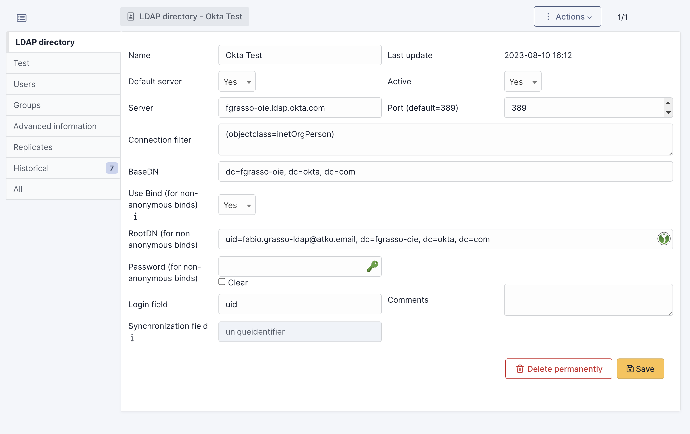

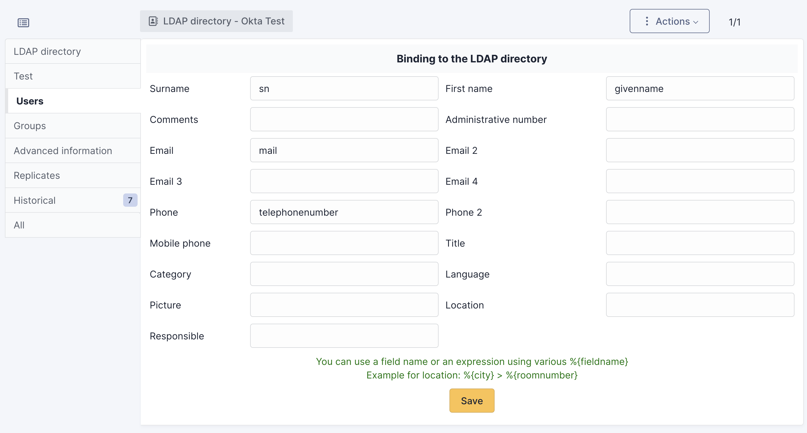

(additional attributes can be added - based on customer needs)

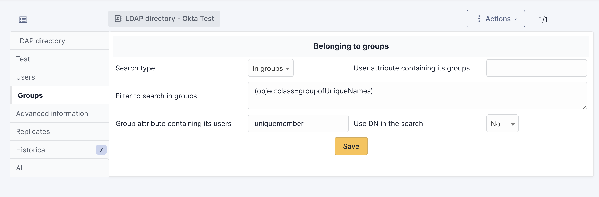

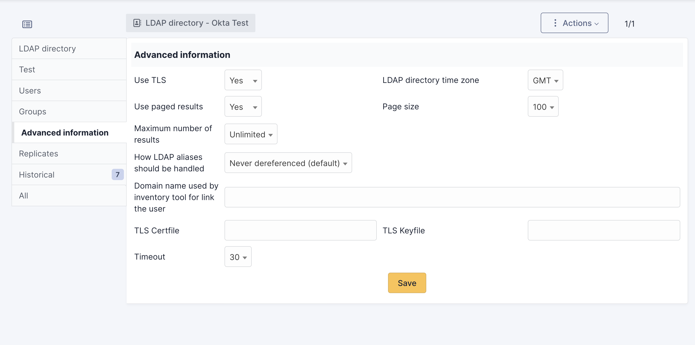

Note: I suggest keeping the timeout as long as possible (the maximum is 30) in order to give to users the time to accept the push notification on the phone (if push MFA is used)

Once the LDAP is configured, you can import users from the Administration / Users > LDAP directory link.

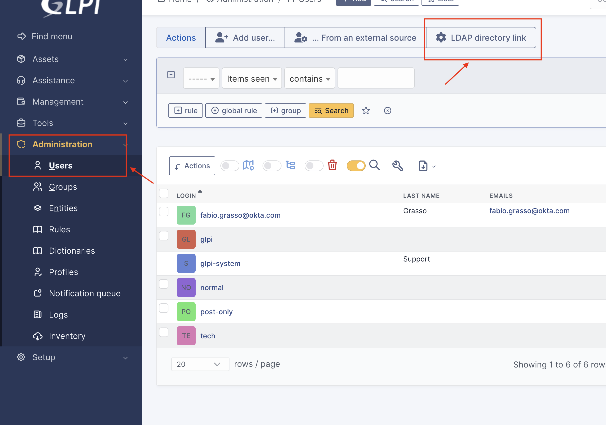

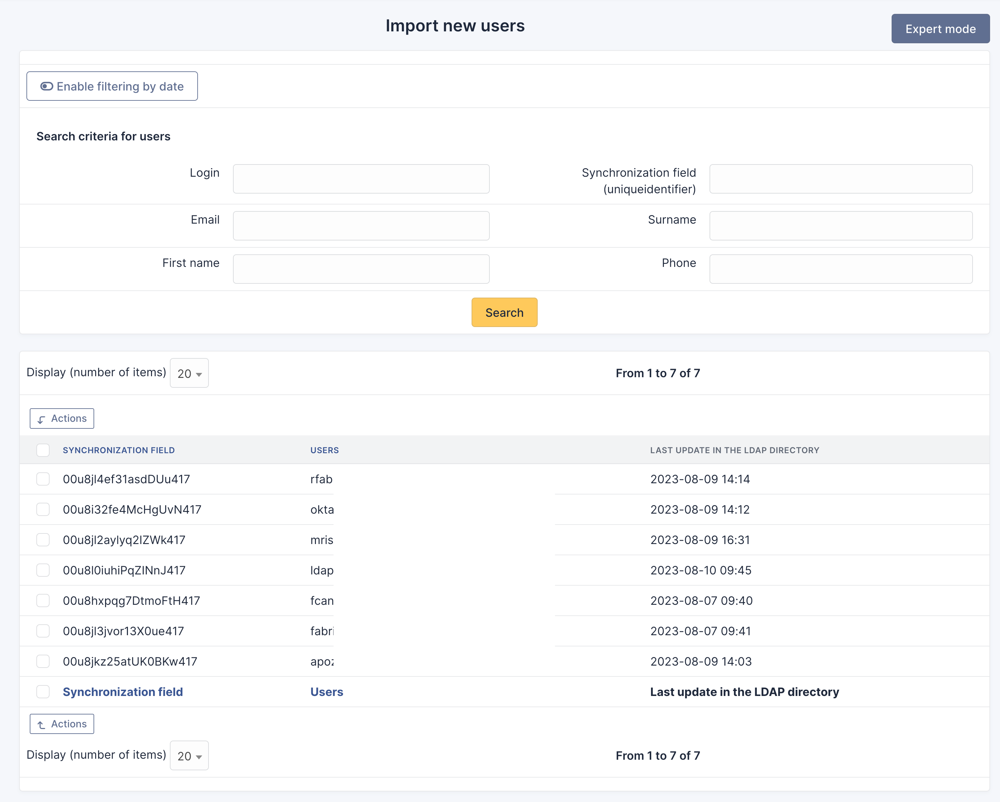

The same can also be done for groups.

Then, the LDAP users can log in by selecting the proper login source on the login page (or by keeping the default one if “Default Server: Yes” is configured on the LDAP setting)

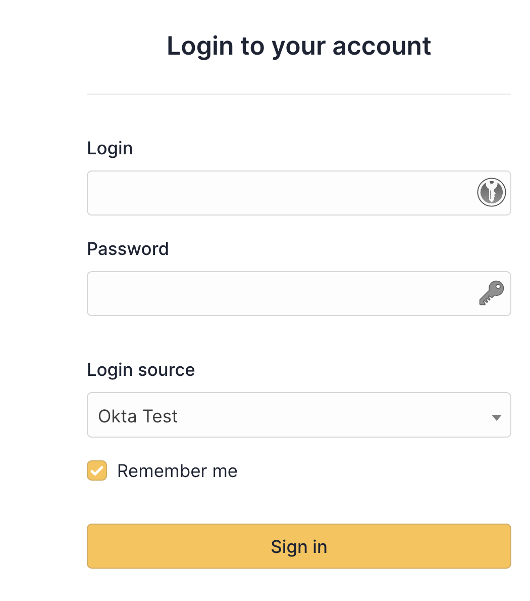

### SAML

The LDAP interface is limited in terms of features and user experience. Another option is to use LDAP. There is an open-source plugin called [phpsaml](https://github.com/derricksmith/phpsaml "https://github.com/derricksmith/phpsaml"). The installation is very easy:

1. Download the zip file from [**Releases · derricksmith/phpsaml**](https://github.com/derricksmith/phpsaml/releases)
2. Extract and copy in the folder `<GLPI_ROOT>/plugins/phpsaml` (if using my docker-compose, that’s the folder `www/plugins/phpsaml`)
3. Enable and configure it from the web interface of GLPI (Setup / Plugins

#### Configuration - Okta Side

On Okta, the configuration is very easy, just a custom SAML application.

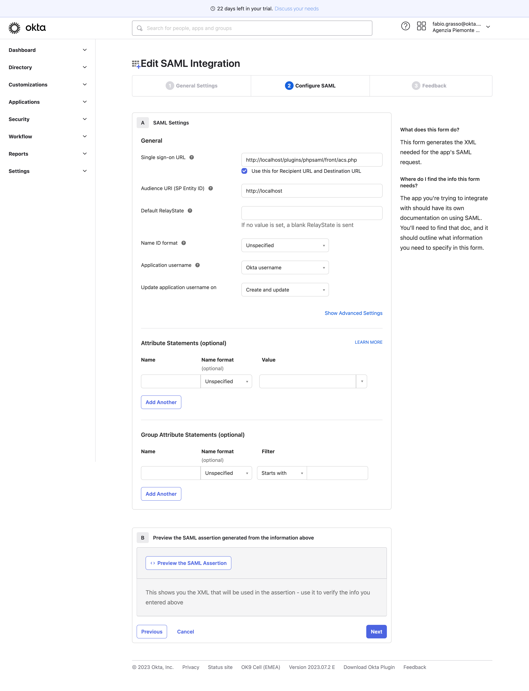

#### Configuration - GLPI Side

For a simple demo perspective and to make the configuration easier, do not enable Strict and Single logout, so there is no need to generate an SP certificate.

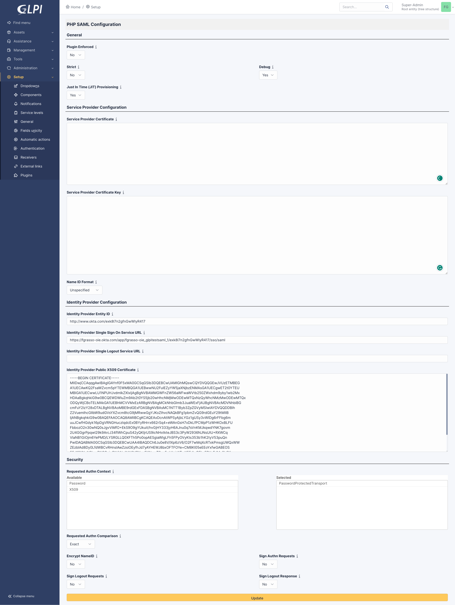

If the Plugin Enforced option is set to Yes, then it will be mandatory for the user to log in using Okta. Otherwise, there is an option “Sign In with SSO” on the login page.

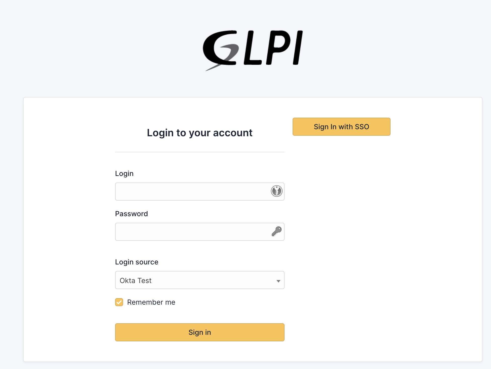

### SAML - SLO

Sample configuration with Single Logout:

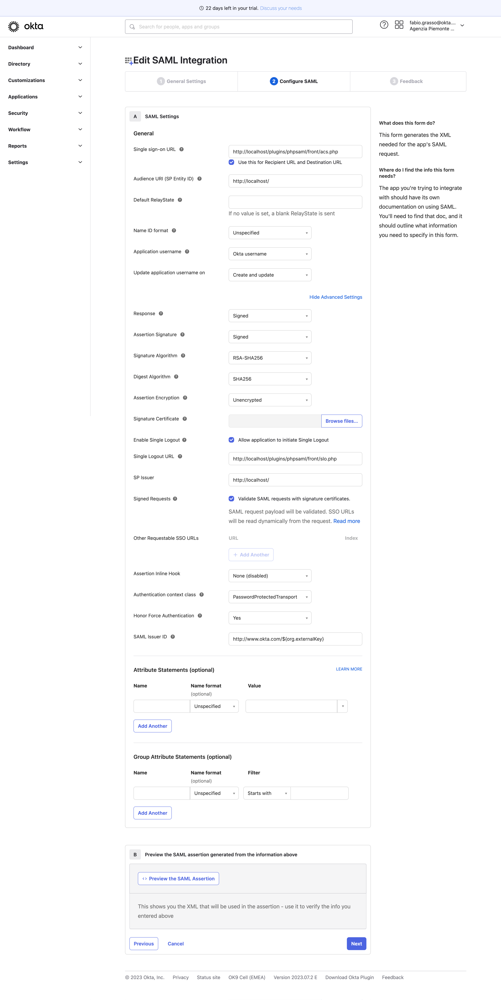

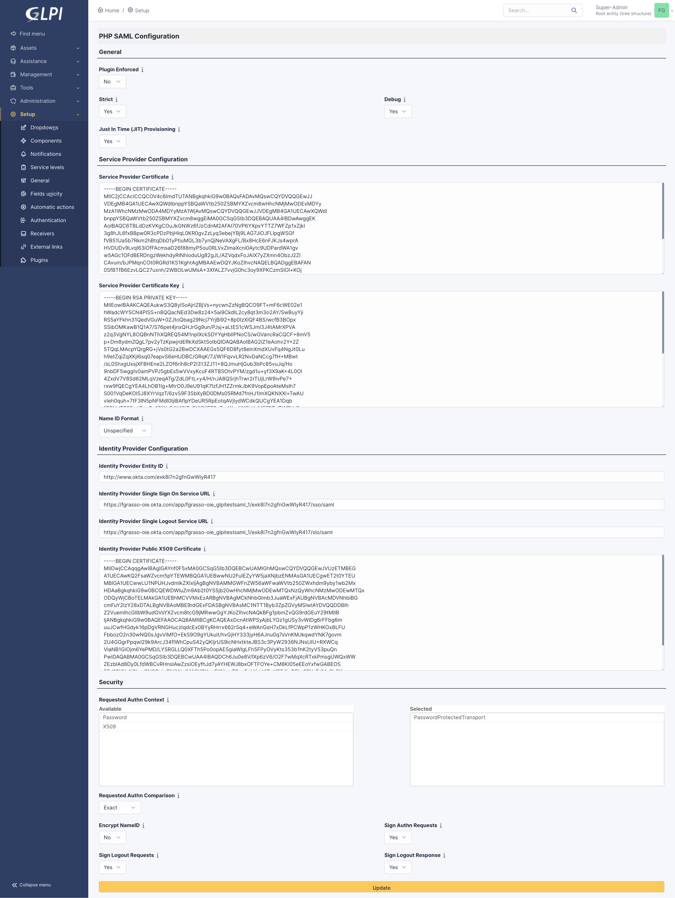

### OAuth / OIDC

The last option for federate GLPI is to use OAuth.

There is a plugin [Oauth SSO client for GLPI](https://services.glpi-network.com/documentation/1731/file/README.md "https://services.glpi-network.com/documentation/1731/file/README.md") included in the [**GLPI Network**](https://services.glpi-network.com/) subscription (BASIC or higher).

In this case, is not included in the Open Source project and can be used only by customers with an active (paid) subscription.

I have not tested it, but they [explicitly mention Okta in their documentation](https://glpi-plugins.readthedocs.io/fr/latest/oauthsso/okta.html).

With the GLPI Network subscription you can also leverage on the [SCIM connector for GLPI](https://glpi-plugins.readthedocs.io/en/latest/scim/index.html).